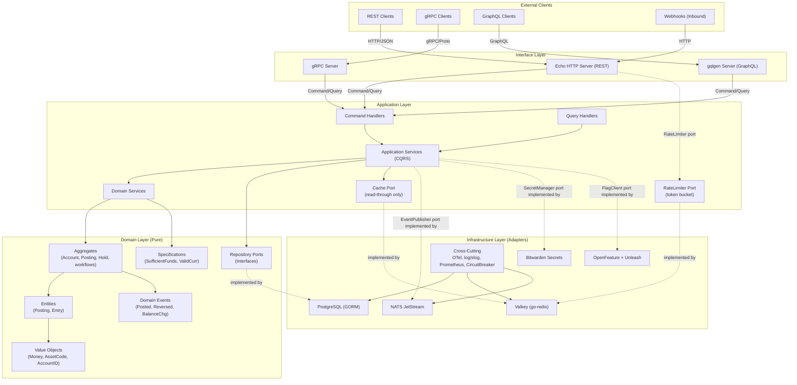

# Fintech Ledger - Data Flow Architecture

**Version:** 1.0.0  
**Status:** Design Phase  
**Related:** [Ledger Core](./ledger-core.md), [User Journeys](./user-journeys.md), [Money Flow](./money-flow.md), [Feature Spec](./fintech-ledger-features.md)

> Accounting writes, balance authority, idempotency, and delivery guarantees are
> governed by `ledger-core.md`. Infrastructure is reached only through
> application/domain-owned ports.

---

## 1. Data Flow Overview



**Note:** Detailed ASCII diagrams for each layer follow below. For best viewing, use a mermaid-compatible viewer (GitHub, GitLab, VS Code with mermaid extension, or https://mermaid.live).

---

## 2. Layer-by-Layer Data Flow

### 2.1 Interface Layer → Application Layer

#### REST (Echo) Flow
```
HTTP Request
     │
     ▼
┌─────────────────────────────────────────────────────────────────┐
│ Echo Middleware Chain                                           │
│ ──────────────────                                              │
│ 1. RequestID Middleware    → Generate/Extract X-Request-ID     │
│ 2. Recovery Middleware     → Panic handling (SPEC §9.7)         │
│ 3. Logger Middleware       → Structured request logging         │
│ 4. Tracer Middleware       → OpenTelemetry span creation        │
│ 5. RateLimit Middleware    → Valkey token bucket check          │
│ 6. Auth Middleware         → JWT validation, Casbin enforcement │
│ 7. FeatureFlag Middleware  → OpenFeature flag checks            │
│ 8. Locale Middleware       → Resolve locale (Accept-Language →  │
│                              tenant default → en) into context  │
│ 9. Validation Middleware   → Request body validation            │
└─────────────────────────────────────────────────────────────────┘
     │
     ▼
Route Handler (e.g., POST /v1/accounts)
     │
     ▼
Bind + Validate Request DTO
     │
     ▼
Convert to Command/Query
     │
     ▼
Application Command/Query Handler
```

**Data Transformation:**
```
HTTP Request          →  DTO                    →  Command
─────────────────────────────────────────────────────────────
POST /accounts        CreateAccountRequest      CreateAccountCommand
Body: {               {                          {
  "name": "Operating",    Name: "Operating",      TenantID: "ten_123",
  "type": "ASSET",        Type: AccountTypeASSET,  Name: "Operating",
  "currency": "USD"       Currency: "USD"         AssetCode: USD,
}                       }                          Currency: USD,
                                                   IdempotencyKey: "acc_create_abc123"
```

#### gRPC Flow
```
gRPC Request (Protobuf)
     │
     ▼
gRPC Interceptors (Auth, Logging, Tracing, RateLimit, Validation)
     │
     ▼
Generated gRPC Handler
     │
     ▼
Convert Proto → Command/Query
     │
     ▼
Application Handler
```

#### GraphQL Flow
```
GraphQL Request
     │
     ▼
gqlgen Resolver
     │
     ▼
DataLoader (N+1 prevention)
     │
     ▼
Application Query/Command Handler
```

---

### 2.2 Application Layer → Domain Layer

#### Command Handler Flow
```
Command Handler (e.g., CreateAccountHandler)
     │
     │ 1. Validate Command DTO (struct tags + custom validators)
     ▼
     │ 2. Reserve durable idempotency key + request fingerprint (PostgreSQL)
     ▼
     │ 3. Load Aggregates via Repository Ports
     │    accountRepo.FindByID(), tenantRepo.Exists()
     ▼
     │ 4. Execute Domain Logic
     │    account := aggregate.NewAccount(cmd)
     │    account.Validate()  // Specifications
     ▼
     │ 5. Collect Domain Events
     │    events := account.UncommittedEvents()
     ▼
     │ 6. Persist aggregate/posting + checkpoints + idempotency result
     │    + outbox in one PostgreSQL transaction
     ▼
     │ 7. After commit, outbox dispatcher publishes events at least once
     ▼
     │ 8. Return Result (errors carry stable codes;
     │    message translation happens at the interface
     │    layer via go-i18n using the context locale)
     ▼
(AccountDTO, error) — stable application/domain errors are mapped to AppError
at the interface boundary
```

#### Query Handler Flow
```
Query Handler (e.g., GetAccountHandler)
     │
     │ 1. Check Cache (Hybrid: Ristretto → Valkey → PostgreSQL)
     ▼
     │ 2. If cache miss: Load via Repository Port
     ▼
     │ 3. Map Domain → DTO
     ▼
     │ 4. Populate Cache (async)
     ▼
     │ 5. Return Result
     ▼
(AccountDTO, error) — stable application/domain errors are mapped to AppError
at the interface boundary
```

---

### 2.3 Domain Layer Operations

#### Aggregate Root Lifecycle
```
Account Aggregate Creation
─────────────────────────
1. Application maps `CreateAccountCommand` to a domain candidate; call `NewAccount(candidate)`
   │
   ├─▶ Generate AccountID (ULID)
   ├─▶ Set Version = 0
   ├─▶ Create AccountCreated domain event
   │     {account_id, tenant_id, name, type, asset_code, opened_at}
   └─▶ Add to uncommitted events

Posting Construction and Commit
───────────────────────────────
1. A versioned posting template constructs positive debit/credit entries.
2. Validate tenant + ledger scope, account status, entry asset/account match,
   positive checked minor units, open period, and per-currency balance.
3. Begin PostgreSQL transaction; reserve the durable idempotency record.
4. Lock spend-constrained accounts in deterministic ID order and evaluate the
   authoritative balance checkpoint plus active holds/reservations.
5. Insert immutable posting + entries, advance account sequences/checkpoints,
   complete idempotency response, and insert outbox events.
6. Commit once. Account metadata does not mutate a balance field.
7. A reversal is a new opposite-side posting linked to the original.
```

#### Specification Evaluation
```
Specification Evaluation (Short-circuit AND)
────────────────────────────────────────────
spec := postingSpec.ForCandidate(authoritativeSnapshot, templateVersion)

result := spec.Evaluate(ctx, candidate)
if !result.Passed() {
    return NewDomainError(result.Violations)
}
```

---

### 2.4 Domain Layer → Infrastructure Layer

#### Repository Implementation Pattern
```go
// Domain defines a small PORT (interface) for the consuming use case.
type AccountRepository interface {
    Create(ctx context.Context, account *Account) error
    FindByID(ctx context.Context, id AccountID) (*Account, error)
    FindByTenant(ctx context.Context, tenantID TenantID, pageToken string) ([]*Account, error)
    UpdateMetadata(ctx context.Context, account *Account, expectedVersion int64) error
    UpdateStatus(ctx context.Context, id AccountID, status AccountStatus, expectedVersion int64) error
}

// Infrastructure provides an ADAPTER. The name describes the implementation;
// avoid an "Impl" suffix and do not leak this type across the port boundary.
type postgresAccountRepository struct {
    db *gorm.DB
}

func (r *postgresAccountRepository) Create(ctx context.Context, a *Account) error {
    // Map Domain → metadata model. Posted facts use the explicit SQL
    // posting/unit-of-work adapter below, not a generic ORM Save call.
    model := toGORMAccount(a)
    return r.db.WithContext(ctx).Create(model).Error
}

func (r *postgresAccountRepository) FindByID(ctx context.Context, id AccountID) (*Account, error) {
    var model AccountModel
    err := r.db.WithContext(ctx).First(&model, "id = ?", id).Error
    if err != nil {
        return nil, err
    }
    return toDomainAccount(model), nil
}
```

#### Cache-Aside Pattern (Hybrid Cache)
```
GetAccountBalance(accountID)
────────────────────────────
1. L1 (Ristretto): GET balance:{tenantID}:{accountID}:{assetCode}:{cursor}
   ├─▶ HIT: Return cached balance (sub-ms)
   └─▶ MISS: Continue

2. L2 (Valkey): GET balance:{tenantID}:{accountID}:{assetCode}:{cursor}
   ├─▶ HIT: Set L1, Return balance (~1ms)
   └─▶ MISS: Continue

3. PostgreSQL: SELECT checkpoint + deltas + active holds at requested cursor
   ├─▶ Set L2 (TTL 5min)
   ├─▶ Set L1 (TTL 1min)
   └─▶ Return balance (~5ms)

PostLedgerPosting(posting)
──────────────────────────
1. PostgreSQL: COMMIT posting + new immutable/monotonic checkpoint
2. Valkey: bump the balance namespace/version for tenant/account/asset (or
   delete the known cursor keys); never rely on an unsupported wildcard delete
3. Ristretto: bump the same namespace/version and evict known hot keys (L1
   invalidation is best-effort because it is only a projection)
4. Pub/Sub: Notify other instances (optional)
```

---

### 2.5 Event Publishing Flow (NATS JetStream)

```
Domain Event Created
───────────────────
AccountCreated {
    EventID: "evt_abc123",
    AggregateID: "acc_xyz789",
    EventType: "account.created.v1",
    OccurredAt: "2026-09-10T10:00:00Z",
    Payload: AccountCreatedPayload{...}
}
     │
     ▼
Domain Event Dispatcher (in Application Layer)
     │
     ├─▶ Serialize to JSON through `pkg/jsonparser` (stdlib default; optional Sonic adapter)
     │
     ├─▶ Enrich with metadata
     │    - trace_id (from context)
     │    - causation_id
     │    - correlation_id
     │
     ▼
NATS JetStream Publisher
     │
     ├─▶ Subject: "ledger.{tenant}.account.created.v1"
     │
     ├─▶ Headers:
     │    Nats-Msg-Id: "evt_abc123"  (deduplication)
     │    Content-Type: application/json
     │    X-Trace-ID: "trace_123"
     │
     ▼
Stream: ACCOUNT_EVENTS (Retention: 7 days, MaxMsgs: 10M)
     │
     ├─▶ Consumer: Webhook Dispatcher (pull, ack)
     ├─▶ Consumer: Analytics Pipeline (pull, ack)
     ├─▶ Consumer: Audit Logger (pull, ack)
     └─▶ Consumer: Notification Service (pull, ack)
```

**Event Subject Naming Convention:**
```
ledger.{tenant}.{event_type}
────────────────────────────
ledger.ten_123.account.created.v1
ledger.ten_123.account.updated.v1
ledger.ten_123.account.closed.v1
ledger.ten_123.account.balance.changed.v1
ledger.ten_123.transaction.posted.v1
ledger.ten_123.transaction.reversed.v1
ledger.ten_123.transfer.completed.v1
ledger.ten_123.reconciliation.break.found.v1
ledger.ten_123.period.closed.v1
```

---

### 2.6 External Integrations Data Flow

#### Payment Processor (Async)
```
┌─────────────────────────────────────────────────────────────────┐
│                    PAYMENT PROCESSOR FLOW                        │
├─────────────────────────────────────────────────────────────────┤
│                                                                  │
│  Application Layer                                              │
│  ────────────────                                               │
│  ConfirmPaymentIntent                                           │
│       │                                                         │
│       ▼                                                         │
│  ┌─────────────────────────────────────────────────────────┐   │
│  │ HTTP Client (with Circuit Breaker, Retry, Timeout)      │   │
│  │ ─────────────────────────────────────────────────────   │   │
│  │ POST <processor>/charges {amount_minor, currency, payment_method}│ │
│  └─────────────────────────────────────────────────────────┘   │
│       │                                                         │
│       ├──▶ SUCCESS: Charge object returned                     │
│       │       │                                                 │
│       │       ▼                                                 │
│       │  NATS: PaymentSucceeded Event                          │
│       │       │                                                 │
│       │       ▼                                                 │
│       │  Application: HandlePaymentSucceeded                   │
│       │       │                                                 │
│       │       ▼                                                 │
│       │  Ledger: DR processor receivable; CR merchant payable │
│       │                                                         │
│       ├──▶ FAILURE: Decline/Error                               │
│       │       │                                                 │
│       │       ▼                                                 │
│       │  NATS: PaymentFailed Event                             │
│       │       │                                                 │
│       │       ▼                                                 │
│       │  Ledger: Update PaymentIntent status = FAILED          │
│       │                                                         │
│       └──▶ TIMEOUT: Circuit breaker opens                      │
│               │                                                 │
│               ▼                                                 │
│         PaymentIntent stays PENDING/OUTCOME_UNKNOWN              │
│         Resolve provider status by idempotency key before retry  │
└─────────────────────────────────────────────────────────────────┘
```

#### FX Rate Service
```
GetFXRate(from, to)
──────────────────
1. Valkey: GET fx:{from}:{to}
   ├─▶ HIT: Return cached rate (TTL 1 hour)
   └─▶ MISS: Continue

2. HTTP Client → External FX API (e.g., exchangerate.host)
   ├─▶ Circuit Breaker protection
   ├─▶ Timeout: 5s
   └─▶ Retry: 3x with backoff

3. Valkey: SET fx:{from}:{to} {rate} EX 3600
4. Return rate
```

---

## 3. Cross-Cutting Data Flows

### 3.1 Correlation ID Propagation
```
Incoming Request
────────────────
Header: X-Request-ID: "req_abc123"
          │
          ▼
┌─────────────────────────────────────────────────────────────────┐
│ Context with Correlation ID                                     │
│ ────────────────────────────                                    │
│ ctx = context.WithValue(ctx, CorrelationIDKey, "req_abc123")   │
│                                                                 │
│ Propagated to:                                                  │
│  • All log entries (log/slog)                                   │
│  • OpenTelemetry spans                                          │
│  • NATS message headers                                         │
│  • gRPC metadata                                                │
│  • Outbound HTTP headers                                        │
│  • Database query comments (for debugging)                     │
└─────────────────────────────────────────────────────────────────┘
```

### 3.2 Tenant Isolation (Multi-Tenancy)
```
Every Query/Command carries TenantID
──────────────────────────────────────
Context: {tenant_id: "ten_123", user_id: "usr_456", roles: ["admin"]}

Repository Queries:
──────────────────
// PostgreSQL (Row Level Security)
SET LOCAL app.current_tenant = 'ten_123';
SELECT * FROM accounts;  // Policy filters by tenant_id

// Valkey Keys
balance:ten_123:acc_789
idempotency:ten_123:abc-123
ratelimit:ten_123:usr_456

// NATS Subjects (tenant-scoped consumers)
ledger.ten_123.account.created.v1
ledger.ten_123.transaction.posted.v1
```

### 3.3 Distributed Tracing (OpenTelemetry)
```
Trace: "req_abc123"
├─ Span: HTTP POST /accounts (Echo)
│  ├─ Span: Auth Middleware
│  ├─ Span: Validation
│  ├─ Span: CreateAccountCommandHandler
│  │  ├─ Span: AccountRepository.Find/Create
│  │  │  └─ Span: PostgreSQL INSERT
│  │  ├─ Span: Domain Event Creation
│  │  └─ Span: NATS Publish
│  │     └─ Span: JetStream Ack
│  └─ Span: Response Serialization
└─ Span: HTTP Response
```

---

## 4. Data Flow by Operation Type

### 4.1 Write Path (Commands)

```
Client Request
      │
      ▼
Interface Layer (REST/gRPC/GraphQL)
      │ Bind + Validate DTO
      ▼
Application Layer (Command Handler)
      │ Durable idempotency reserve/fingerprint (PostgreSQL)
      │ Load Aggregates (Repo → Cache → DB)
      ▼
Domain Layer (Aggregate + Specifications)
      │ Business Logic + Invariant Validation
      │ Generate Domain Events
      ▼
Infrastructure Layer (Repository + Event Publisher)
      │ PostgreSQL: Posting + entries + checkpoints + idempotency + outbox
      │ Valkey: Invalidate Cache
      │ Outbox: publish domain events after commit, at least once
      ▼
Response to Client
```

**Transaction Boundary:** Single PostgreSQL transaction covers aggregate persistence + event outbox (if using transactional outbox pattern).

### 4.2 Read Path (Queries)

```
Client Request
      │
      ▼
Interface Layer
      ▼
Application Layer (Query Handler)
      │
      ├─▶ Hybrid Cache: Ristretto → Valkey → PostgreSQL
      │
      └─▶ If cache miss: Repository → Domain → DTO → Cache
      ▼
Response to Client
```

**Cache Strategy:**
| Data Type | L1 (Ristretto) | L2 (Valkey) | Invalidation |
|-----------|----------------|-------------|--------------|
| Account Balance | 1 min | 5 min | On write; key includes tenant/account/asset/cursor |
| Account Config | 5 min | 30 min | On update |
| Tenant Config | 10 min | 1 hour | On update |
| FX Rates | N/A | 1 hour | TTL expiry |
| Idempotency Hints | N/A | 24 hours | Optional expiry; PostgreSQL is the durable idempotency record |
| Rate Limit Counters | N/A | 1 min | Sliding window |

### 4.3 Async Event Processing

```
NATS JetStream Message Received
      │
      ▼
Consumer (e.g., Webhook Dispatcher)
      │
      ├─▶ Deserialize Event
      │
      ├─▶ Claim durable inbox row (PostgreSQL: consumer + event_id)
      │
      ├─▶ Transform Payload and perform handler effects in the same transaction
      │
      ├─▶ Commit inbox claim + handler effects, then Ack Message
      │
      └─▶ On Failure: 
           ├─▶ Retry (exponential backoff, max 5)
           ├─▶ Dead Letter Queue (after max retries)
           └─▶ Alert on DLQ
```

---

## 5. Data Models & Schemas

### 5.1 PostgreSQL Schema (Key Tables)

```sql
-- Illustrative core only. Migrations add workflow, reconciliation, audit, and
-- operational columns, constraints, partitions, and RLS policies.
CREATE TABLE tenants (
    id          VARCHAR(26) PRIMARY KEY,
    name        VARCHAR(255) NOT NULL,
    status      VARCHAR(20) NOT NULL,
    created_at  TIMESTAMPTZ NOT NULL DEFAULT clock_timestamp()
);

CREATE TABLE asset_registry (
    code        VARCHAR(12) PRIMARY KEY,
    exponent    SMALLINT NOT NULL CHECK (exponent BETWEEN 0 AND 9),
    kind        VARCHAR(20) NOT NULL,
    valid_from  DATE NOT NULL,
    valid_to    DATE
);

CREATE TABLE ledgers (
    id          VARCHAR(26) PRIMARY KEY,
    tenant_id   VARCHAR(26) NOT NULL REFERENCES tenants(id),
    legal_entity_id VARCHAR(26) NOT NULL,
    base_asset_code VARCHAR(12) NOT NULL REFERENCES asset_registry(code),
    created_at  TIMESTAMPTZ NOT NULL DEFAULT clock_timestamp(),
    UNIQUE (tenant_id, id)
);

CREATE TABLE accounts (
    id              VARCHAR(26) PRIMARY KEY,
    tenant_id       VARCHAR(26) NOT NULL REFERENCES tenants(id),
    ledger_id       VARCHAR(26) NOT NULL,
    account_number  VARCHAR(80) NOT NULL,
    name            VARCHAR(255) NOT NULL,
    class           VARCHAR(20) NOT NULL CHECK (class IN ('ASSET','LIABILITY','EQUITY','REVENUE','EXPENSE')),
    normal_side     VARCHAR(6) NOT NULL CHECK (
        (class IN ('ASSET','EXPENSE') AND normal_side = 'DEBIT') OR
        (class IN ('LIABILITY','EQUITY','REVENUE') AND normal_side = 'CREDIT')
    ),
    asset_code      VARCHAR(12) NOT NULL REFERENCES asset_registry(code),
    purpose         VARCHAR(80) NOT NULL,
    status          VARCHAR(20) NOT NULL,
    version         BIGINT NOT NULL DEFAULT 0,
    created_at      TIMESTAMPTZ NOT NULL DEFAULT clock_timestamp(),
    UNIQUE (tenant_id, ledger_id, account_number),
    UNIQUE (tenant_id, ledger_id, id),
    FOREIGN KEY (tenant_id, ledger_id)
      REFERENCES ledgers(tenant_id, id)
);

CREATE TABLE postings (
    id                  VARCHAR(26) PRIMARY KEY,
    tenant_id           VARCHAR(26) NOT NULL REFERENCES tenants(id),
    ledger_id           VARCHAR(26) NOT NULL,
    operation           VARCHAR(100) NOT NULL,
    operation_version   INTEGER NOT NULL,
    external_reference  VARCHAR(255),
    effective_at        TIMESTAMPTZ NOT NULL,
    recorded_at         TIMESTAMPTZ NOT NULL DEFAULT clock_timestamp(),
    reversal_of         VARCHAR(26),
    description         TEXT,
    metadata            JSONB NOT NULL DEFAULT '{}',
    UNIQUE (tenant_id, ledger_id, id),
    FOREIGN KEY (tenant_id, ledger_id)
      REFERENCES ledgers(tenant_id, id),
    FOREIGN KEY (tenant_id, ledger_id, reversal_of)
      REFERENCES postings(tenant_id, ledger_id, id)
);

CREATE TABLE entries (
    id              VARCHAR(26) PRIMARY KEY,
    tenant_id       VARCHAR(26) NOT NULL,
    ledger_id       VARCHAR(26) NOT NULL,
    posting_id      VARCHAR(26) NOT NULL,
    account_id      VARCHAR(26) NOT NULL,
    account_seq     BIGINT NOT NULL,
    side            VARCHAR(6) NOT NULL CHECK (side IN ('DEBIT','CREDIT')),
    amount_minor    BIGINT NOT NULL CHECK (amount_minor > 0),
    asset_code      VARCHAR(12) NOT NULL REFERENCES asset_registry(code),
    UNIQUE (account_id, account_seq),
    FOREIGN KEY (tenant_id, ledger_id, posting_id)
      REFERENCES postings(tenant_id, ledger_id, id),
    FOREIGN KEY (tenant_id, ledger_id, account_id)
      REFERENCES accounts(tenant_id, ledger_id, id)
);

CREATE TABLE balance_checkpoints (
    tenant_id       VARCHAR(26) NOT NULL,
    ledger_id       VARCHAR(26) NOT NULL,
    account_id      VARCHAR(26) NOT NULL,
    ledger_cursor   BIGINT NOT NULL,
    debits_minor    NUMERIC(38,0) NOT NULL,
    credits_minor   NUMERIC(38,0) NOT NULL,
    recorded_at     TIMESTAMPTZ NOT NULL,
    PRIMARY KEY (tenant_id, ledger_id, account_id, ledger_cursor),
    FOREIGN KEY (tenant_id, ledger_id, account_id)
      REFERENCES accounts(tenant_id, ledger_id, id)
);

CREATE TABLE holds (
    id              VARCHAR(26) PRIMARY KEY,
    tenant_id       VARCHAR(26) NOT NULL,
    ledger_id       VARCHAR(26) NOT NULL,
    account_id      VARCHAR(26) NOT NULL,
    amount_minor    BIGINT NOT NULL CHECK (amount_minor > 0),
    asset_code      VARCHAR(12) NOT NULL REFERENCES asset_registry(code),
    kind            VARCHAR(30) NOT NULL,
    state           VARCHAR(20) NOT NULL,
    expires_at      TIMESTAMPTZ,
    released_at     TIMESTAMPTZ,
    version         BIGINT NOT NULL DEFAULT 0,
    FOREIGN KEY (tenant_id, ledger_id, account_id)
      REFERENCES accounts(tenant_id, ledger_id, id)
);

CREATE TABLE idempotency_records (
    tenant_id       VARCHAR(26) NOT NULL,
    operation       VARCHAR(100) NOT NULL,
    idempotency_key VARCHAR(100) NOT NULL,
    request_hash    BYTEA NOT NULL,
    state           VARCHAR(30) NOT NULL,
    resource_id     VARCHAR(26),
    response_status INTEGER,
    response_body   JSONB,
    lease_expires_at TIMESTAMPTZ,
    expires_at      TIMESTAMPTZ NOT NULL,
    PRIMARY KEY (tenant_id, operation, idempotency_key)
);

CREATE TABLE outbox_events (
    id                VARCHAR(26) PRIMARY KEY,
    tenant_id         VARCHAR(26) NOT NULL,
    ledger_id         VARCHAR(26),
    aggregate_id      VARCHAR(26) NOT NULL,
    aggregate_version BIGINT NOT NULL,
    sequence          BIGINT NOT NULL,
    event_type        VARCHAR(120) NOT NULL,
    envelope          JSONB NOT NULL,
    recorded_at       TIMESTAMPTZ NOT NULL,
    published_at      TIMESTAMPTZ,
    attempts          INTEGER NOT NULL DEFAULT 0,
    UNIQUE (aggregate_id, aggregate_version),
    FOREIGN KEY (tenant_id, ledger_id)
      REFERENCES ledgers(tenant_id, id)
);

CREATE TABLE inbox_receipts (
    consumer_name VARCHAR(100) NOT NULL,
    event_id      VARCHAR(26) NOT NULL,
    processed_at  TIMESTAMPTZ NOT NULL,
    PRIMARY KEY (consumer_name, event_id)
);

CREATE INDEX idx_entries_account_sequence ON entries(account_id, account_seq DESC);
CREATE INDEX idx_postings_ledger_recorded ON postings(tenant_id, ledger_id, recorded_at, id);
CREATE INDEX idx_outbox_unpublished ON outbox_events(recorded_at, id) WHERE published_at IS NULL;
```

The composite foreign keys are intentional: a valid identifier from another
tenant or ledger must never be enough to create a child row. The posting
function/procedure must additionally verify that each entry asset matches its
account asset and reject a posting unless every asset code balances; these
cross-column rules require a procedure or trigger rather than a simple foreign
key. Posted rows must be non-updatable/non-deletable. Workflow tables
(`payment_intents`, authorizations, captures, refunds, disputes, payouts),
immutable external-source files/lines, match groups, audit records, and approval
records are separate from this core schema.

---

## 6. Target Data Consistency Contracts

| Operation | Consistency Level | Mechanism |
|-----------|-------------------|-----------|
| **Transaction Post** | Strong (ACID) | Single PostgreSQL transaction |
| **Balance Read (decision/read-after-write)** | Strong | Primary checkpoint + deltas + durable holds at cursor |
| **Balance Read (display/cache)** | Bounded stale | Hybrid cache/replica; response exposes cursor/as-of |
| **Cross-Account Transfer** | Strong | SELECT FOR UPDATE + Single TX |
| **Event Publishing** | At-least-once | NATS JetStream ack + deduplication |
| **Webhook Delivery** | At-least-once | Retry + DLQ + idempotency keys |
| **Reconciliation** | Eventual | Daily batch, break resolution workflow |

---

## 7. Data Retention & Archival

| Data Type | Hot Storage | Warm Storage | Cold Storage | Retention |
|-----------|-------------|--------------|--------------|-----------|
| **Transactions** | 2 years (PostgreSQL) | 5 years (Partitioned) | 7 years (S3/Glacier) | 7 years |
| **Entries** | 2 years | 5 years | 7 years | 7 years |
| **Domain Events** | 30 days (NATS) | 1 year (PostgreSQL) | 7 years (S3) | 7 years |
| **Audit Logs** | 1 year (Loki) | 7 years (S3) | Indefinite | Indefinite |
| **Reconciliation** | 2 years | 7 years | 7 years | 7 years |
| **FX Rates** | 1 year | 7 years | 7 years | 7 years |

---

## 8. Data Flow Security

| Flow | Encryption | Integrity | Access Control |
|------|------------|-----------|----------------|
| **Client → API** | TLS 1.3 | JWT Signature | JWT + Casbin |
| **API → PostgreSQL** | TLS (if remote) | N/A | Role-based (app user) |
| **API → Valkey** | TLS (if remote) | N/A | ACL user |
| **API → NATS** | TLS | N/A | NKey/JWT |
| **Event → Webhook** | TLS 1.3 | HMAC-SHA256 | Webhook Secret |
| **Inter-Service** | mTLS | N/A | SPIFFE/SPIRE |

---

*This data-flow design defines clean separation of concerns, tenant isolation,
and traceability targets; implementation and evidence are required before they
are claimed.*
