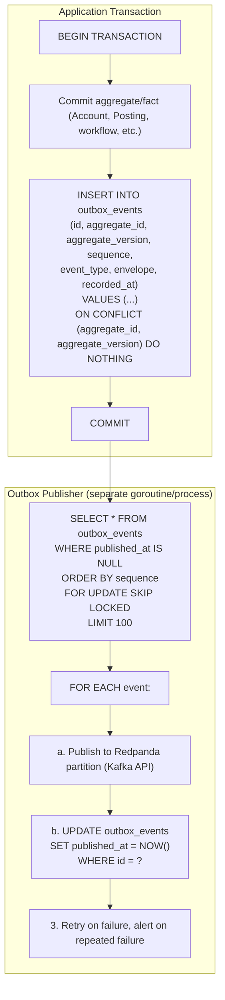
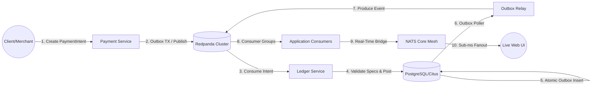
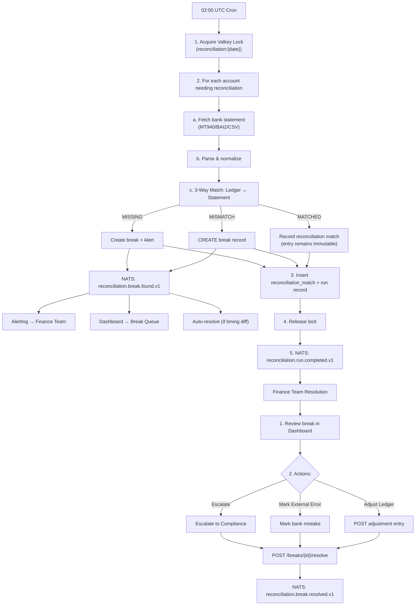

# Fintech Ledger - Domain Events & Event Flows Specification

**Version:** 1.0.0  
**Status:** Design Phase  
**Related:** [User Journeys](./user-journeys.md), [Money Flow](./money-flow.md), [Data Flow](./data-flow.md), [API Contracts](./api-contracts.md)

---

## 1. Domain Event Design Principles

| Principle | Implementation |
|-----------|----------------|
| **Immutable** | Events never change after creation |
| **Ordered** | Per-aggregate ordering via sequence number and partition keys |
| **Idempotent Consumption** | Deduplication via event ID |
| **At-Least-Once Delivery** | Redpanda (Kafka API) producer ack + Transactional Outbox |
| **Edge Low-Latency Fanout**| NATS Core in-memory publish (<50µs) |
| **Schema Versioned** | Event type includes version (`v1`, `v2`) |
| **Correlated** | `causation_id`, `correlation_id` for tracing |
| **Tenant-Scoped** | All events carry `tenant_id` for isolation |
| **Minimal Payload** | Only changed data + identifiers; committed-posting events may
  include the complete immutable entry set needed by audit/reconciliation |

Internal domain/outbox envelopes and public webhooks are separate schemas.
Webhook projections are allow-listed and must not expose idempotency keys,
internal account numbers, unrestricted metadata/PII, actor IDs, or trace details.

---

## 2. Domain Event Structure

### 2.1 Base Event Interface (Go)
```go
// internal/domain/event/base.go

type DomainEvent interface {
    // EventID returns globally unique event identifier (ULID)
    EventID() string
    
    // AggregateID returns the ID of the aggregate that emitted this event
    AggregateID() string
    
    // AggregateType returns the type of aggregate (Account, Posting, Hold, etc.)
    AggregateType() string
    
    // EventType returns the event type with version (e.g., "account.created.v1")
    EventType() string
    
    // OccurredAt returns when the event happened
    OccurredAt() time.Time

    // AggregateVersion and Sequence define ordering; timestamps do not
    AggregateVersion() int64
    Sequence() int64
    
    // Payload returns the event-specific data
    Payload() any
    
    // Metadata returns correlation/causation info
    Metadata() EventMetadata
}

type EventMetadata struct {
    // TenantID for multi-tenancy isolation
    TenantID string `json:"tenant_id"`

    // LedgerID scopes accounting facts inside the tenant
    LedgerID string `json:"ledger_id,omitempty"`
    
    // CausationID links to the command that caused this event
    CausationID string `json:"causation_id,omitempty"`
    
    // CorrelationID groups related events across aggregates
    CorrelationID string `json:"correlation_id,omitempty"`
    
    // UserID who initiated the action
    UserID string `json:"user_id,omitempty"`
    
    // TraceID for distributed tracing
    TraceID string `json:"trace_id,omitempty"`
    
    // Additional context
    Custom map[string]string `json:"custom,omitempty"`
}

// BaseEvent provides common implementation
type BaseEvent struct {
    IDValue          string        `json:"event_id"`
    AggregateIDValue string        `json:"aggregate_id"`
    AggregateKind    string        `json:"aggregate_type"`
    TypeValue        string        `json:"event_type"`
    OccurredAtValue  time.Time     `json:"occurred_at"`
    RecordedAt       time.Time     `json:"recorded_at"`
    AggregateVer     int64         `json:"aggregate_version"`
    SequenceValue    int64         `json:"sequence"`
    PayloadData      any           `json:"payload"`
    Meta             EventMetadata `json:"metadata"`
}

func (e BaseEvent) EventID() string          { return e.IDValue }
func (e BaseEvent) AggregateID() string      { return e.AggregateIDValue }
func (e BaseEvent) AggregateType() string    { return e.AggregateKind }
func (e BaseEvent) EventType() string        { return e.TypeValue }
func (e BaseEvent) OccurredAt() time.Time    { return e.OccurredAtValue }
func (e BaseEvent) AggregateVersion() int64  { return e.AggregateVer }
func (e BaseEvent) Sequence() int64          { return e.SequenceValue }
func (e BaseEvent) Payload() any             { return e.PayloadData }
func (e BaseEvent) Metadata() EventMetadata  { return e.Meta }
```

The earlier field/method name collisions were invalid Go. Implementations must
compile this envelope and serialize the full envelope, not only `Payload()`.
Event constructors must defensively copy maps and slices (or expose immutable
payload values) so the published envelope cannot be changed after the outbox
insert.

### 2.2 JSON Serialization (codec port)

The examples use JSON for wire compatibility. Implementations should default to
`encoding/json`; a benchmark-justified Sonic adapter may sit behind the shared
codec port, but the domain package must not import either serializer.
```json
{
  "event_id": "evt_01ARZ3NDEKTSV4RRFFQ69G5FAV",
  "aggregate_id": "acc_01ARZ3NDEKTSV4RRFFQ69G5FAV",
  "aggregate_type": "Account",
  "aggregate_version": 1,
  "sequence": 42,
  "event_type": "account.created.v1",
  "occurred_at": "2026-09-10T10:00:00.123456Z",
  "recorded_at": "2026-09-10T10:00:00.223456Z",
  "payload": {
    "account_id": "acc_01ARZ3NDEKTSV4RRFFQ69G5FAV",
    "tenant_id": "ten_01ARZ3NDEKTSV4RRFFQ69G5FAV",
    "account_number": "ACC-20260910-001",
    "name": "Operating Account",
    "type": "ASSET",
    "asset_code": "USD"
  },
  "metadata": {
    "tenant_id": "ten_01ARZ3NDEKTSV4RRFFQ69G5FAV",
    "ledger_id": "led_01ARZ3NDEKTSV4RRFFQ69G5FAV",
    "causation_id": "cmd_01ARZ3NDEKTSV4RRFFQ69G5FAV",
    "correlation_id": "corr_01ARZ3NDEKTSV4RRFFQ69G5FAV",
    "user_id": "usr_01ARZ3NDEKTSV4RRFFQ69G5FAV",
    "trace_id": "trace_01ARZ3NDEKTSV4RRFFQ69G5FAV"
  }
}
```

---

## 3. Domain Event Catalog

### 3.1 Account Events

| Event Type | Trigger | Payload | Consumers |
|------------|---------|---------|-----------|
| `account.created.v1` | `CreateAccountCommand` success | AccountCreatedPayload | Webhook, Audit, Analytics, Search Index |
| `account.updated.v1` | `UpdateAccountCommand` success | AccountUpdatedPayload | Webhook, Audit, Analytics |
| `account.frozen.v1` | `FreezeAccountCommand` success | AccountFrozenPayload | Webhook, Audit, Compliance, Notifications |
| `account.unfrozen.v1` | `UnfreezeAccountCommand` success | AccountUnfrozenPayload | Webhook, Audit, Notifications |
| `account.closed.v1` | `CloseAccountCommand` success | AccountClosedPayload | Webhook, Audit, Compliance, Reconciliation |
| `account.verified.v1` | Microdeposit amounts confirmed | AccountVerifiedPayload | Webhook, Audit, Compliance |
| `account.balance.changed.v1` | Any balance-affecting operation | BalanceChangedPayload | Webhook, Real-time Dashboard, Alerting |

#### AccountCreatedPayload
```go
type AccountCreatedPayload struct {
    AccountID      string  `json:"account_id"`
    TenantID       string  `json:"tenant_id"`
    AccountNumber  string  `json:"account_number"`
    Name           string  `json:"name"`
    Type           string  `json:"type"`           // ASSET, LIABILITY, etc.
    AssetCode      string  `json:"asset_code"`     // Registry-backed asset code
    Status         string  `json:"status"`         // ACTIVE
    OpenedBy       string  `json:"opened_by"`      // UserID
}
```

#### BalanceChangedPayload
```go
type BalanceChangedPayload struct {
    AccountID      string    `json:"account_id"`
    TenantID       string    `json:"tenant_id"`
    AssetCode      string    `json:"asset_code"`
    PostedMinor    int64     `json:"posted_minor"`
    AvailableMinor int64     `json:"available_minor"`
    HeldMinor      int64     `json:"held_minor"`
    PendingMinor   int64     `json:"pending_minor"`
    ReservedMinor  int64     `json:"reserved_minor"`
    LedgerCursor   int64     `json:"ledger_cursor"`
    AsOf           time.Time `json:"as_of"`
    ReferenceType  string    `json:"reference_type"`
    ReferenceID    string    `json:"reference_id"`
}
```

---

### 3.2 Transaction Events

`transaction.posted` is the compatibility public/API name for an accepted
immutable Posting. `transaction.reversed` means a new reversal posting was
committed; the original did not change. `transaction.pending/failed` are
application/workflow notifications only and must never create or mutate ledger
entries.

| Event Type | Trigger | Payload | Consumers |
|------------|---------|---------|-----------|
| `transaction.posted.v1` | Transaction committed | TransactionPostedPayload | Webhook, Audit, Reconciliation, Reporting, Analytics |
| `transaction.reversed.v1` | Reversal committed | TransactionReversedPayload | Webhook, Audit, Reconciliation, Reporting |
| `transaction.failed.v1` | Transaction validation failed | TransactionFailedPayload | Webhook, Alerting, Compliance |
| `transaction.pending.v1` | Transaction created (async) | TransactionPendingPayload | Webhook, Status Tracking |

#### TransactionPostedPayload
```go
type TransactionPostedPayload struct {
    PostingID       string            `json:"posting_id"`
    TenantID        string            `json:"tenant_id"`
    LedgerID        string            `json:"ledger_id"`
    Operation       string            `json:"operation"`         // Versioned template name
    Description     string            `json:"description"`
    Reference       string            `json:"reference"`
    Entries         []EntryPayload    `json:"entries"`
    RecordedAt      time.Time         `json:"recorded_at"`
}

type EntryPayload struct {
    EntryID       string `json:"entry_id"`
    AccountID     string `json:"account_id"`
    AccountNumber string `json:"account_number"`
    Direction     string `json:"direction"`     // DEBIT, CREDIT
    AmountMinor   int64  `json:"amount_minor"` // Positive minor units
    AssetCode     string `json:"asset_code"`
    AccountSeq    int64  `json:"account_sequence"`
}
```

#### TransactionReversedPayload
```go
type TransactionReversedPayload struct {
    PostingID            string            `json:"posting_id"`
    TenantID             string            `json:"tenant_id"`
    OriginalPostingID    string            `json:"original_posting_id"`
    ReversalType         string            `json:"reversal_type"`        // FULL, PARTIAL
    ReversedAmountMinor  int64             `json:"reversed_amount_minor"`
    ReversedEntries      []EntryPayload    `json:"reversed_entries"`
    Reason               string            `json:"reason"`
    ReversedAt           time.Time         `json:"reversed_at"`
    Metadata             map[string]string `json:"metadata,omitempty"`
}
```

---

### 3.3 Transfer Events

| Event Type | Trigger | Payload | Consumers |
|------------|---------|---------|-----------|
| `transfer.created.v1` | TransferCommand success | TransferCreatedPayload | Webhook, Status Tracking |
| `transfer.completed.v1` | Both entries posted | TransferCompletedPayload | Webhook, Audit, Reconciliation |
| `transfer.failed.v1` | Validation/balance failure | TransferFailedPayload | Webhook, Alerting |
| `transfer.canceled.v1` | User cancelled pending | TransferCanceledPayload | Webhook, Audit |
| `transfer.batch.received.v1` | Batch intake accepted (fan-out) | TransferBatchReceivedPayload | Batch workers |
| `transfer.batch.completed.v1` | All batch items settled | TransferBatchCompletedPayload | Webhook, Audit |

---

### 3.4 Payment Events

| Event Type | Trigger | Payload | Consumers |
|------------|---------|---------|-----------|
| `payment_intent.created.v1` | PaymentIntent created | PaymentIntentCreatedPayload | Webhook, Frontend |
| `payment_intent.succeeded.v1` | PaymentProcessor success | PaymentSucceededPayload | Webhook, Ledger (posts transaction) |
| `payment_intent.failed.v1` | PaymentProcessor decline/error | PaymentFailedPayload | Webhook, Frontend, Alerting |
| `payment_intent.canceled.v1` | User/API cancel | PaymentCanceledPayload | Webhook, Frontend |
| `payment_intent.requires_action.v1` | SCA/3DS challenge needed | PaymentActionRequiredPayload | Webhook, Frontend |
| `payment.captured.v1` | Capture posted (full/partial) | PaymentCapturedPayload | Webhook, Ledger, Reconciliation |
| `payment.settled.v1` | Provider/bank settlement confirmed | PaymentSettledPayload | Webhook, Reconciliation, Reporting |

#### PaymentSettledPayload
```go
type PaymentSettledPayload struct {
    PaymentID        string    `json:"payment_id"`
    TenantID         string    `json:"tenant_id"`
    Provider         string    `json:"provider"`
    ProviderObjectID string    `json:"provider_object_id"`
    SettlementBatchID string   `json:"settlement_batch_id"`
    PostingID        string    `json:"posting_id"`
    AmountMinor      int64     `json:"amount_minor"`
    AssetCode        string    `json:"asset_code"`
    ProviderTraceID  string    `json:"provider_trace_id"`
    SettledAt        time.Time `json:"settled_at"`
}
```

---

### 3.5 Refund Events

| Event Type | Trigger | Payload |
|------------|---------|---------|
| `refund.created.v1` | RefundCommand success | RefundCreatedPayload |
| `refund.succeeded.v1` | Refund processed + posted | RefundSucceededPayload |
| `refund.failed.v1` | Refund processing failed | RefundFailedPayload |

---

### 3.6 Payout Events

| Event Type | Trigger | Payload |
|------------|---------|---------|
| `payout.created.v1` | PayoutCommand success | PayoutCreatedPayload |
| `payout.pending.v1` | Submitted to network | PayoutPendingPayload |
| `payout.paid.v1` | Bank confirms settlement | PayoutPaidPayload |
| `payout.failed.v1` | Network reject/error | PayoutFailedPayload |

---

### 3.7 Reconciliation Events

| Event Type | Trigger | Payload |
|------------|---------|---------|
| `reconciliation.run.started.v1` | Cron trigger | ReconciliationRunStartedPayload |
| `reconciliation.run.completed.v1` | Run finished | ReconciliationRunCompletedPayload |
| `reconciliation.break.found.v1` | Mismatch detected | ReconciliationBreakFoundPayload |
| `reconciliation.break.resolved.v1` | Break resolved | ReconciliationBreakResolvedPayload |
| `reconciliation.break.acknowledged.v1` | Break acknowledged | ReconciliationBreakAcknowledgedPayload |

---

### 3.8 Period Events

| Event Type | Trigger | Payload |
|------------|---------|---------|
| `period.opened.v1` | New period created | PeriodOpenedPayload |
| `period.closed.v1` | Period close workflow | PeriodClosedPayload |
| `period.reopened.v1` | Admin reopen | PeriodReopenedPayload |

---

### 3.9 FX Rate Events

| Event Type | Trigger | Payload |
|------------|---------|---------|
| `fx.rate.updated.v1` | New rate fetched | FxRateUpdatedPayload |

---

### 3.10 Fee Events

| Event Type | Trigger | Payload |
|------------|---------|---------|
| `fee.assessed.v1` | Fee calculated | FeeAssessedPayload |
| `fee.collected.v1` | Fee posted to ledger | FeeCollectedPayload |

---

### 3.11 Report Events (Application-Level)

Unlike §§3.1–3.10, report events originate from the **reporting application service**
(read-model), not from an aggregate. They exist so async report generation can notify
API clients via the same webhook pipeline:

| Event Type | Trigger | Payload |
|------------|---------|---------|
| `report.generated.v1` | Report rendering finished, download ready | ReportGeneratedPayload |

```go
type ReportGeneratedPayload struct {
    ReportID    string `json:"report_id"`
    TenantID    string `json:"tenant_id"`
    Template    string `json:"template"`     // trial_balance, balance_sheet, ...
    Format      string `json:"format"`       // pdf, csv, xlsx
    DownloadURL string `json:"download_url"` // Time-limited signed URL
    PeriodStart string `json:"period_start"` // YYYY-MM-DD
    PeriodEnd   string `json:"period_end"`
}
```

Subject: `ledger.{tenant}.report.generated.v1`. The reporting service writes
the completed report state and outbox row atomically. Reproducibility does not
make direct broker publication reliable.

---

### 3.12 Dispute Events

| Event Type | Trigger | Payload | Consumers |
|------------|---------|---------|-----------|
| `dispute.opened.v1` | Network dispute notification (or manual open) | DisputeOpenedPayload | Webhook, Compliance, Notifications |
| `dispute.closed.v1` | Decision won/lost | DisputeClosedPayload | Webhook, Ledger (posts reversal on loss), Audit |

```go
type DisputeOpenedPayload struct {
    DisputeID     string `json:"dispute_id"`
    TenantID      string `json:"tenant_id"`
    TransactionID string `json:"transaction_id"` // public compatibility alias for the immutable capture PostingID
    Network       string `json:"network"`        // VISA, MASTERCARD, ACH, ...
    AmountMinor   int64  `json:"amount_minor"`
    FeeMinor      int64  `json:"fee_minor"`      // Network dispute fee
    AssetCode     string `json:"asset_code"`
    EvidenceDueAt string `json:"evidence_due_at"` // RFC 3339
}

type DisputeClosedPayload struct {
    DisputeID     string `json:"dispute_id"`
    TenantID      string `json:"tenant_id"`
    Outcome       string `json:"outcome"`        // WON, LOST
    ReversalTxnID string `json:"reversal_txn_id,omitempty"` // set on LOST
}
```

---

### 3.13 Top-up Events

| Event Type | Trigger | Payload | Consumers |
|------------|---------|---------|-----------|
| `topup.succeeded.v1` | Bank debit settled | TopUpPayload | Webhook, Ledger (posts approved funding journal) |
| `topup.failed.v1` | Bank reject/error | TopUpFailedPayload | Webhook, Alerting |

```go
type TopUpPayload struct {
    TopUpID       string `json:"topup_id"`
    TenantID      string `json:"tenant_id"`
    AccountID     string `json:"account_id"`     // Credited account
    AmountMinor   int64  `json:"amount_minor"`
    AssetCode     string `json:"asset_code"`
    BankAccountID string `json:"bank_account_id"`
}
```

---

### 3.14 Tenant Events

| Event Type | Trigger | Payload | Consumers |
|------------|---------|---------|-----------|
| `tenant.created.v1` | Tenant onboarding committed | TenantCreatedPayload | Audit, Analytics, Webhook |

```go
type TenantCreatedPayload struct {
    TenantID       string    `json:"tenant_id"`
    LedgerID       string    `json:"ledger_id"`
    Name           string    `json:"name"`
    Region         string    `json:"region"`
    BaseAssetCode  string    `json:"base_asset_code"`
    CreatedAt      time.Time `json:"created_at"`
}
```

---

### 3.15 Privacy Events (Internal)

PII erasure is an internal control-plane event. It is retained for audit and
must not expose the erased value or become a public webhook unless a separately
approved projection is added.

| Event Type | Trigger | Payload | Consumers |
|------------|---------|---------|-----------|
| `pii.erased.v1` | Erasure workflow committed | PIIErasedPayload | Audit, Compliance |

```go
type PIIErasedPayload struct {
    ErasureID    string    `json:"erasure_id"`
    TenantID     string    `json:"tenant_id"`
    SubjectType  string    `json:"subject_type"`
    SubjectID    string    `json:"subject_id"`
    PolicyVersion string   `json:"policy_version"`
    ErasedAt     time.Time `json:"erased_at"`
}
```

---

## 4. Event Flow Patterns

### 4.1 Event Sourcing vs. State + Events

**Decision: State + Domain Events** (not full Event Sourcing)

- Aggregates store current state in PostgreSQL
- Domain Events record committed facts consumed by side effects and integrations
- Transactional outbox retains integration facts for controlled delivery replay;
  the immutable ledger/audit records remain their own sources of truth
- Not using events as source of truth for state reconstruction

### 4.2 Transactional Outbox Pattern



**Benefits:**
- **Atomic:** Event persisted iff transaction commits
- **Reliable:** No lost events on crash
- **At-least-once:** a crash after broker ack and before marking published may
  redeliver; consumers use a durable inbox/effect key
- **Ordered where declared:** aggregate/partition sequence is explicit; wall-clock
  or database commit order is not presented as global event order

---

### 4.3 Event Publishing Flow: Dual-Broker Architecture

The repository enforces a dual-broker split:
1. **Redpanda v26.2 (Durable Event Log)**: The Transactional Outbox poller publishes domain events to partitioned Redpanda topics using the Kafka producer API.
2. **NATS Core v2.14.6 (Real-Time Edge Mesh)**: Lightweight in-memory bridge relays push signals to NATS Core subjects for sub-millisecond edge WebSocket fanout.

```go
// internal/infrastructure/messaging/redpanda/publisher.go

type RedpandaPublisher struct {
    writer  *kafka.Writer // segmentio/kafka-go or IBM/sarama
    encoder EventEncoder  // pkg/jsonparser codec
}

func (p *RedpandaPublisher) Publish(ctx context.Context, event DomainEvent) error {
    // 1. Serialize the versioned envelope
    data, err := p.encoder.Encode(event)
    if err != nil {
        return fmt.Errorf("encode event: %w", err)
    }

    // 2. Build partition key: tenant_id:aggregate_id guarantees strict per-account ordering
    partitionKey := fmt.Sprintf("%s:%s", event.Metadata().TenantID, event.AggregateID())

    // 3. Build Kafka message with metadata headers
    msg := kafka.Message{
        Topic: "ledger.events.v1",
        Key:   []byte(partitionKey),
        Value: data,
        Headers: []kafka.Header{
            {Key: "X-Event-ID", Value: []byte(event.EventID())},
            {Key: "X-Event-Type", Value: []byte(event.EventType())},
            {Key: "X-Tenant-ID", Value: []byte(event.Metadata().TenantID)},
            {Key: "X-Trace-ID", Value: []byte(event.Metadata().TraceID)},
        },
    }

    // 4. Produce to Redpanda with leader ack
    return p.writer.WriteMessages(ctx, msg)
}
```

```go
// internal/infrastructure/messaging/nats/publisher.go (Edge Push Bridge)

type NATSEdgePublisher struct {
    nc *nats.Conn // Pure in-memory NATS Core connection
}

func (p *NATSEdgePublisher) BroadcastBalanceUpdate(ctx context.Context, tenantID, accountID string, balance int64) error {
    subject := fmt.Sprintf("updates.tenant.%s.account.%s.balance", tenantID, accountID)
    payload := fmt.Sprintf(`{"tenant_id":"%s","account_id":"%s","available_minor":%d}`, tenantID, accountID, balance)
    return p.nc.Publish(subject, []byte(payload))
}
```

### 4.4 Topic and Subject Naming Conventions

#### A. Redpanda Durable Topics (Kafka API)
```
ledger.events.v1
money-movement.transfers.v1
compliance.kyc.v1
```
* Partition Key: `{tenant_id}:{aggregate_id}` (guarantees strictly ordered partition logs per financial entity).
* Canonical persistent stream configuration: `stream: LEDGER_EVENTS` (logical event log stream).

#### B. NATS Core Edge Subjects & Event Routing
```
ledger.{tenant_id}.{event_type}
──────────────────────────────
Examples:
ledger.ten_abc123.account.created.v1
ledger.ten_abc123.account.balance.changed.v1
ledger.ten_abc123.transaction.posted.v1
ledger.ten_abc123.transfer.completed.v1
ledger.ten_abc123.payment_intent.succeeded.v1
ledger.ten_abc123.reconciliation.break.found.v1
```
* In addition to granular topic partitions in Redpanda, real-time edge notifications use the canonical `ledger.{tenant_id}.{event_type}` subject hierarchy for sub-millisecond WebSocket fanout directly to client subscriptions.

---

## 5. Event Consumer Patterns

> Ordering contract: **no global ordering is guaranteed.** Order by the explicit
> `aggregate_version`/`sequence` within one aggregate or declared partition;
> `occurred_at` is informational. Across aggregates, consumers must be idempotent
> (dedupe on `event_id`, §5.2) and tolerant of out-of-order arrival
> (e.g., a `transfer.completed` arriving before its `transfer.created` must not
> break the handler). Webhook receivers get the same guarantee — see
> api-contracts §11.

### 5.1 Consumer Groups (Redpanda Kafka API)

```yaml
# Consumer configurations per service
consumer_groups:
  # Webhook Dispatcher - delivers to merchant endpoints
  webhook-dispatcher:
    topics:
      - ledger.events.v1
      - money-movement.transfers.v1
    group_id: ledger-webhook-dispatcher
    auto_offset_reset: earliest
    max_poll_interval_ms: 300000
    session_timeout_ms: 45000
    retry_max: 5
    dead_letter_topic: ledger.events.dlq.v1

  # Analytics Pipeline - feeds data lakehouse
  analytics-pipeline:
    topics:
      - ledger.events.v1
    group_id: ledger-analytics-pipeline
    auto_offset_reset: earliest

  # Audit Archiver - regulatory compliance
  audit-archiver:
    topics:
      - ledger.events.v1
      - compliance.kyc.v1
    group_id: ledger-audit-archiver
    auto_offset_reset: earliest

  # Real-Time Bridge - publishes lightweight updates to NATS Core
  realtime-bridge:
    topics:
      - ledger.events.v1
    group_id: ledger-realtime-bridge
    auto_offset_reset: latest

  # Reconciliation Engine - processes transactions and breaks
  reconciliation-engine:
    topics:
      - ledger.events.v1
      - money-movement.transfers.v1
    group_id: ledger-reconciliation-engine
    auto_offset_reset: earliest
    max_poll_interval_ms: 300000
    session_timeout_ms: 45000
    retry_max: 3
    dead_letter_topic: ledger.events.dlq.v1
```

### 5.2 Idempotent Consumer Pattern

The inbox is a durable PostgreSQL record, not a Valkey key with a TTL. The
inbox insert, handler side effects, and receipt commit share one transaction;
the broker acknowledgement happens only after that commit.

The example below is intentionally abbreviated: in production, `InboxTx` must
also expose (or carry) the transaction-scoped unit of work used by the handler.
`EventHandler.Handle` must not open an independent database transaction between
`Claim` and `Commit`; otherwise a crash can commit side effects without the
receipt (or the receipt without the side effects). Adapter implementations may
inject a transaction-bound application command bus instead of adding domain
repositories directly to this messaging package.

```go
// internal/infrastructure/messaging/nats/consumer/idempotent.go

type InboxStore interface {
    Begin(ctx context.Context) (InboxTx, error)
}

type InboxTx interface {
    Claim(ctx context.Context, consumerID, eventID string) (claimed bool, err error)
    Commit() error
    Rollback() error
}

type IdempotentConsumer struct {
    inbox   InboxStore
    decoder EventDecoder
    handler EventHandler
}

func (c *IdempotentConsumer) Handle(ctx context.Context, msg *nats.Msg) error {
    event, err := c.decoder.Decode(msg.Data)
    if err != nil {
        return fmt.Errorf("decode event: %w", err)
    }

    tx, err := c.inbox.Begin(ctx)
    if err != nil {
        return fmt.Errorf("begin inbox transaction: %w", err)
    }
    defer tx.Rollback() // harmless after a successful commit

    claimed, err := tx.Claim(ctx, c.handler.Name(), event.EventID())
    if err != nil {
        return fmt.Errorf("claim event: %w", err)
    }
    if !claimed {
        return msg.Ack() // durable receipt already committed
    }
    if err := c.handler.Handle(ctx, event); err != nil {
        return err // rollback; consumer group redelivers
    }
    if err := tx.Commit(); err != nil {
        return fmt.Errorf("commit inbox effects: %w", err)
    }
    return msg.Ack()
}
```

---

## 6. Event Replay & Reconciliation

### 6.1 Replay Scenarios

| Scenario | Method | Scope |
|----------|--------|-------|
| **New Consumer** | Reset consumer offset to stream start | All events |
| **Bug Fix** | Replay from specific timestamp | Affected event types |
| **Data Corruption** | Replay + reproject | Specific aggregates |
| **Audit** | Export events for compliance | Filtered by tenant/date |

### 6.2 Replay API
```bash
# Replay all events for tenant from date
POST /admin/events/replay
{
  "tenant_id": "ten_abc123",
  "from_timestamp": "2026-09-01T00:00:00Z",
  "event_types": ["transaction.posted.v1", "transfer.completed.v1"],
  "target_consumers": ["analytics-pipeline", "webhook-dispatcher"]
}

# Replay specific aggregate
POST /admin/events/replay
{
  "aggregate_id": "acc_abc123",
  "target_consumers": ["audit-logger"]
}
```

---

## 7. Dead Letter Queue (DLQ) Handling

```go
// DLQ Consumer - processes failed messages. Durable storage is a database or
// object-store port; a cache TTL must not be the only replay copy.
type DLQConsumer struct {
    store    DLQStore
    alerting AlertingService
    logger   Logger
}

type DLQStore interface {
    Put(ctx context.Context, eventID, subject string, payload []byte, deliveryCount string) error
}

func (d *DLQConsumer) Handle(ctx context.Context, msg *nats.Msg) error {
    eventID := msg.Header.Get("Nats-Msg-Id")
    deliveryCount := msg.Header.Get("Nats-Delivery-Count")

    // Log for investigation through the kernel slog port.
    d.logger.Error(ctx, "event moved to DLQ", "event_id", eventID,
        "subject", msg.Subject, "delivery_count", deliveryCount)

    // Alert on-call
    if err := d.alerting.SendAlert(Alert{
        Level:   "critical",
        Title:   "Event Processing Failed - DLQ",
        Message: fmt.Sprintf("Event %s failed after %s deliveries", eventID, deliveryCount),
        Context: map[string]string{
            "event_id":      eventID,
            "subject":       msg.Subject,
            "delivery_count": deliveryCount,
        },
    }); err != nil {
        return fmt.Errorf("send DLQ alert: %w", err)
    }

    // Store the immutable envelope and failure metadata for manual replay.
    if err := d.store.Put(ctx, eventID, msg.Subject, msg.Data, deliveryCount); err != nil {
        return fmt.Errorf("store DLQ message: %w", err)
    }

    // Ack to remove from DLQ
    return msg.Ack()
}
```

---

## 8. Event Schema Evolution

### 8.1 Versioning Strategy

| Change Type | Approach | Example |
|-------------|----------|---------|
| **Add optional field** | Same version | Add `metadata` to payload |
| **Add required field** | New version (`v2`) | `account.created.v2` |
| **Remove field** | New version + deprecate | Mark `v1` deprecated |
| **Change field type** | New version | display decimal → integer minor units |
| **Rename field** | New version + alias | `account_number` → `number` |

### 8.2 Backward Compatibility Rules

```go
// Event decoder handles multiple versions. The concrete codec is injected;
// this example uses the standard-library-compatible Decode method.
// Imports omitted from the surrounding package: context, encoding/json.
type EventDecoder interface {
    Decode(data []byte) (DomainEvent, error)
}

type EventHandler interface {
    Name() string
    Handle(context.Context, DomainEvent) error
}

func decodeAccountCreated(data []byte, version string) (*AccountCreatedPayload, error) {
    switch version {
    case "v1":
        var v1 AccountCreatedPayloadV1
        if err := json.Unmarshal(data, &v1); err != nil {
            return nil, err
        }
        return v1.ToCurrent(), nil
    case "v2":
        var v2 AccountCreatedPayloadV2
        if err := json.Unmarshal(data, &v2); err != nil {
            return nil, err
        }
        return v2.ToCurrent(), nil
    default:
        return nil, fmt.Errorf("unsupported version: %s", version)
    }
}
```

---

## 9. Event Flow Diagrams

### 9.1 Payment Processing Event Flow



**Sequence Steps:**
1. **Client** creates PaymentIntent → **Payment Service**
2. **Payment Service** records intent and outbox emits `payment_intent.created.v1` → **Redpanda**
3. **Ledger Service** consumes intent from **Redpanda** partition
4. **Ledger Service** validates domain specs (SufficientFunds, AccountActive)
5. **Ledger Service** posts double-entry transaction + inserts outbox event atomically in **PostgreSQL/Citus**
6. **Outbox Poller** claims unpublished outbox rows via `SELECT FOR UPDATE SKIP LOCKED`
7. **Outbox Poller** produces `transaction.posted.v1` to **Redpanda** with key `{tenant_id}:{account_id}`
8. **Redpanda Consumer Groups** process: Webhook Dispatcher, Audit Archiver, Reconciliation Engine
9. **Real-Time Bridge Consumer** publishes lightweight balance notification to **NATS Core** subject
10. **NATS Core** fans out sub-millisecond updates to active **WebSocket Clients**

### 9.2 Reconciliation Event Flow



**Key Points:**
- **Distributed Lock** prevents concurrent runs
- **3-Way Match** compares Ledger ↔ Statement
- **Break Detection** creates records & publishes events
- **Auto-Resolve** handles timing differences
- **Finance Team** resolves via Dashboard → API → NATS event

---

## 10. Event Metrics & Observability

### 10.1 Key Metrics

| Metric | Type | Description | Alert |
|--------|------|-------------|-------|
| `events.published.total` | Counter | Total events published | N/A |
| `events.published.latency` | Histogram | Publish latency (ms) | p99 > 100ms |
| `events.consumed.total` | Counter | Total events consumed | N/A |
| `events.consumed.latency` | Histogram | Consume latency (ms) | p99 > 500ms |
| `events.dlq.size` | Gauge | Dead letter queue size | > 0 |
| `events.replay.active` | Gauge | Active replays | > 0 |
| `events.schema.version` | Gauge | Current schema version | N/A |

### 10.2 Distributed Tracing for Events

```go
// Add trace context to event metadata
func (e *BaseEvent) WithTraceContext(ctx context.Context) *BaseEvent {
    span := trace.SpanFromContext(ctx)
    if span.SpanContext().IsValid() {
        e.Meta.TraceID = span.SpanContext().TraceID().String()
        e.Meta.CorrelationID = e.Meta.CorrelationID
        if e.Meta.CorrelationID == "" {
            e.Meta.CorrelationID = span.SpanContext().TraceID().String()
        }
    }
    return e
}
```

---

## 11. Testing Event Flows

### 11.1 Unit Tests (Domain)
```go
func TestPosting_EmitsPostedEvent(t *testing.T) {
    posting, err := NewPosting(captureFixture())
    require.NoError(t, err)

    events := posting.UncommittedEvents()
    require.Len(t, events, 1)
    evt := events[0]
    assert.Equal(t, posting.ID().String(), evt.AggregateID())
    payload, ok := evt.Payload().(TransactionPostedPayload)
    require.True(t, ok)
    assert.Equal(t, int64(10000), payload.Entries[0].AmountMinor)
}
```

### 11.2 Integration Tests (Event Publishing)
```go
func TestTransfer_PublishesTransactionPostedEvent(t *testing.T) {
    ctx := context.Background()
    
    // Execute transfer
    result, err := transferService.ExecuteTransfer(ctx, transferFixture())
    require.NoError(t, err)
    
    // Verify event published to NATS
    msg := natsTestHelper.WaitForEvent(ctx, "ledger.*.transaction.posted.v1", 5*time.Second)
    
    var envelope struct {
        Payload json.RawMessage `json:"payload"`
    }
    require.NoError(t, json.Unmarshal(msg.Data, &envelope))
    var payload TransactionPostedPayload
    require.NoError(t, json.Unmarshal(envelope.Payload, &payload))

    assert.Equal(t, result.PostingID.String(), payload.PostingID)
    assert.Len(t, payload.Entries, 2)
}
```

---

## 12. Event Retention & Compliance

| Event Category | Retention | Storage | Compliance |
|----------------|-----------|---------|------------|
| **Financial** (transactions, transfers, payments) | 7 years | PostgreSQL + S3 | SOX, PCI, Audit |
| **Account Lifecycle** | 7 years | PostgreSQL + S3 | Audit |
| **Reconciliation** | 7 years | PostgreSQL + S3 | Audit |
| **Operational** (balance changes, FX) | 2 years | NATS (30d) + PostgreSQL | Operations |
| **Debug/Trace** | 30 days | NATS + Loki | Debugging |

---

## 13. Implementation Checklist

### Phase 2 (Domain Layer)
- [ ] Define all event structs in `internal/domain/event/`
- [ ] Implement `DomainEvent` interface for each
- [ ] Add event emission to aggregate roots
- [ ] Write unit tests for event emission

### Phase 3 (Infrastructure)
- [ ] Implement Redpanda Kafka API publisher with Transactional Outbox poller
- [ ] Implement NATS Core real-time in-memory edge fanout bridge
- [ ] Implement consumer framework with Kafka consumer groups and idempotency
- [ ] Configure Redpanda topics, partitions, and DLQ
- [ ] Add event serialization through `pkg/jsonparser` (stdlib default; optional Sonic adapter)

### Phase 4 (Application)
- [ ] Wire event publishing in command handlers
- [ ] Implement event handlers for async workflows
- [ ] Add correlation ID propagation

### Phase 5 (Interface)
- [ ] Webhook dispatcher consumer
- [ ] Webhook signature verification
- [ ] Event replay admin API

---

*This event specification defines the target consistent, reliable, and
auditable event-driven architecture; implementation and operational evidence
are required before those properties are claimed.*
