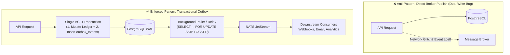

# Infrastructure Architecture & Persistence Guide

This document is the normative architectural reference for the Infrastructure layer (`internal/infrastructure/`), database lifecycle operations (`scripts/db/`, `cmd/seed/`), event outbox propagation, and test harnesses.

---

## 1. Core Persistence Principles: The Ledger as System of Record (SoR)

In a double-entry fintech platform, the relational database (PostgreSQL) is the authoritative **System of Record (SoR)**. 

### Synchronous Balance Validation vs. Asynchronous Queuing
* **The System of Record Guarantee**: Every state-changing financial mutation (authorizations, captures, transfers, refunds, hold placements) must verify business rules against strongly consistent, uncommitted row state.
* **Immediate Transactional Integrity**: When an API client submits a payment, the platform must synchronously answer:
  * `201 Created` / `200 OK` (Funds reserved/transferred)
  * `422 Unprocessable Entity` (Insufficient available balance)
  * `409 Conflict` (Concurrent in-flight idempotency clash)
* **Why Ledger Mutations Cannot Be "Queue-First"**:
  If incoming transfer requests are buffered in a queue (e.g. NATS) before hitting the database, the API can only return `202 Accepted` ("Request received, we'll try moving the money later"). This breaks point-of-sale authorizations, merchant checkouts, and introduces double-spending race conditions across competing transactions.

---

## 2. Event Delivery: The Transactional Outbox Pattern

To communicate state changes to downstream services (webhooks, merchant notifications, analytics, reporting read models) without introducing distributed consistency bugs, this repository mandates the **Transactional Outbox Pattern** (`internal/infrastructure/database/postgres/outbox`).

### The Dual-Write Problem
Attempting to write to a database and publish to a message broker in separate network calls creates an unsolvable distributed systems dilemma:
1. **DB Commit Succeeds, Publish Fails**: If the network blinks during the broker publish call, the money moved in PostgreSQL, but no event is ever emitted. Downstream webhooks, fraud monitoring, and emails are permanently lost.
2. **Publish Succeeds, DB Commit Fails**: If the event is sent before the DB commits, but the DB rolls back due to a constraint violation or lock conflict, downstream consumers process phantom transactions for money that never moved.



### Outbox Mechanics in this Repository
1. **Atomic Insertion**: When `PostingRepository.Commit` or workflow services mutate entities, an event record is written to the `outbox_events` table **in the same database transaction**.
2. **Non-Blocking Polling**: The `outbox.Poller` queries unpublished rows using `SELECT ... FOR UPDATE SKIP LOCKED`. It never blocks incoming transaction writes and allows multiple concurrent outbox workers.
3. **Lease Timeout & Crash Recovery**: Workers claim batches with a configurable lease timeout (`ClaimTimeout = 60s`). If a worker crashes or loses network connectivity mid-dispatch, surviving workers automatically reclaim the expired lease and deliver the event without human intervention.
4. **At-Least-Once Delivery**: The outbox guarantees *at-least-once* delivery. Downstream consumers must be idempotent (using the event's unique `id` or idempotency key).

---

## 3. Idempotency Keys vs. Concurrency Control (Double Spending)

A common misconception in distributed architecture is assuming that an **Idempotency Key** prevents **Double Spending**. They solve two completely different problems:

| Dimension | Idempotency Key | Concurrency Control (Row Locking) |
|---|---|---|
| **What Problem Does It Solve?** | **Identical retries of the SAME request** (e.g. user double-clicks submit, mobile network drops and retries packet). | **Competing DISTINCT requests** attempting to spend the same limited resource/balance at the same instant. |
| **Example Scenario** | User sends \$100 to Amazon once, client network times out and resends identical request `idem_123`. | User with \$100 in wallet sends \$100 to Amazon (`idem_1`) AND \$100 to Apple (`idem_2`) at the exact same millisecond. |
| **Result Without Protection** | Amazon gets paid \$200 (duplicate payment for single order). | User spends \$200 from a \$100 balance (Double Spend / negative balance). |
| **Resolution Mechanism** | Cache and replay the original response payload for identical `(tenant_id, key)`. | Pessimistic locking (`SELECT ... FOR UPDATE`) to serialize ledger access per account. |

### Why Idempotency Alone Cannot Protect a Queue-First Architecture
If an API buffers requests in a queue before writing to the database:
1. Two distinct requests arrive for a wallet with \$100:
   * Request A: \$100 to Merchant 1 (`key: req_a`)
   * Request B: \$100 to Merchant 2 (`key: req_b`)
2. Both keys are completely unique, so the queue accepts both. The API returns `202 Accepted` to both merchants.
3. Two worker consumers process the queue concurrently. Both see the initial balance is \$100.
4. Without synchronous database serialization, both deduct \$100, leaving the account at -\$100. Even with database locks, one worker fails asynchronously—after the API already promised `202 Accepted` to the customer!

Furthermore, **in-flight idempotency** requires synchronous database coordination:
* If Request 1 (`key: req_123`) is sitting in a queue waiting to be processed, and a retry Request 2 (`key: req_123`) arrives, the API cannot know if `req_123` is already executing unless it queries a shared, strongly consistent state store.
* Our architecture solves this by atomically **reserving** the idempotency key in PostgreSQL inside the initial transaction:
  ```sql
  INSERT INTO idempotency_keys (key, tenant_id, request_hash, state)
  VALUES ($1, $2, $3, 'PENDING')
  ```
  If a duplicate arrives while the first is in-flight, PostgreSQL's primary key constraint immediately rejects it with `409 Conflict`.

---

## 4. Database Lifecycle: Why Migrations & Seeding Are Decoupled from `main.go`

In small monolithic apps, engineers often run migrations on application boot (e.g., in `main.go` using `CREATE TABLE IF NOT EXISTS`). In high-concurrency fintech platforms, this is prohibited for four operational and security reasons:

### A. Horizontal Autoscaling & Schema Lock Contention
In Kubernetes, deployments spin up multiple replicas (5 to 50 pods) simultaneously:
* DDL operations (`ALTER TABLE`, `CREATE INDEX`, foreign key additions) acquire PostgreSQL **`ACCESS EXCLUSIVE`** locks.
* If multiple pods boot concurrently and attempt schema migrations:
  * Pods enter lock contention or lock-wait timeouts, triggering Kubernetes readiness probe failures (`CrashLoopBackOff`).
  * If live user traffic is actively querying the database while an app pod attempts DDL, query queues back up, exhausting the connection pool.

### B. Principle of Least Privilege (Security & Compliance)
Fintech compliance standards (SOC 2, PCI-DSS, ISO 27001) require strict separation of database privileges:
* **Runtime Application Role (`app_user`)**: Restricted to Data Manipulation Language (DML: `SELECT`, `INSERT`, `UPDATE`). It **cannot** perform DDL (`DROP TABLE`, `ALTER TABLE`, `CREATE TABLE`).
  * If an application endpoint suffers a SQL injection vulnerability or remote code execution, the attacker cannot drop tables or alter security policies.
* **Migration Role (`postgres` / migration admin)**: Elevated administrative role required to run DDL.
  * Migrations run exclusively in a dedicated, ephemeral CI/CD deployment step or a single-shot Kubernetes `Job` using migration credentials. Migration credentials are never mounted inside runtime application containers.

### C. Prevention of Accidental Seeding in Production
Development seeds populate dummy tenants (`tnt-test-01`), test accounts, and fake initial balances. Compiling seeding logic into the main service binary creates the constant risk that a misconfigured environment variable or developer flag could trigger dev seeding against staging or production databases. Decoupling seeding into `cmd/seed` and `scripts/db/seed.sh` guarantees seed code is never called by production servers.

### D. Zero-Downtime Blue-Green / Canary Deployments (Expand/Contract)
During production rolling updates, `v1` and `v2` pods run side-by-side:
1. **Expand Phase**: Database migrations run *before* new code deploys. The schema is expanded in a backward-compatible manner (new nullable columns, additive tables). Both `v1` and `v2` pods can read/write successfully.
2. **Deploy Phase**: `v2` application pods roll out and serve traffic.
3. **Contract Phase**: A subsequent migration removes deprecated columns once `v1` pods are completely decommissioned.
Decoupled migration tooling gives the release pipeline explicit control over this multi-stage lifecycle.

---

## 5. Operational Scripting Suite (`scripts/db/`)

The repository provides automated, hardened operational scripts for database lifecycle management:

| Script | Purpose | Safeguards |
|---|---|---|
| `scripts/db/migrate.sh` | Applies, rolls back, or inspects embedded migration versions using the `migrate` CLI. | Uses advisory locks; requires explicit `DATABASE_URL`. |
| `scripts/db/seed.sh` | Migrates up and applies deterministic development seed data via `cmd/seed`. | Evaluates `-h`/`--help` without requiring database connection. |
| `scripts/db/reset.sh` | Drops `public` schema, re-applies all migrations from version 1, and seeds dev data. | **Production guard**: Refuses to run against URLs containing `prod`, `amazonaws.com`, or `cloudsql` unless `--force` is passed. |
| `scripts/db/backup.sh` | Generates compressed `.dump` archive (`pg_dump -Fc`) and captures WAL pointers for Point-In-Time Recovery. | Evaluates help before requiring database; writes timestamped dumps. |
| `scripts/db/restore.sh` | Restores a `.dump` archive into a target scratch database. | Refuses to write to the source database; requires explicit scratch destination. |
| `scripts/db/verify-restore.sh` | Automated disaster-recovery drill: boots/connects to a scratch DB, restores dump, checks row counts and connectivity. | Proves RTO/RPO targets are achievable; alerts on backup corruption. |

---

## 6. Test Fixture Parity (`test/fixtures`)

To prevent test fragmentation, `test/fixtures` serves as the **Single Source of Truth (SSOT)** for test constants and builders:
* **Canonical Identifiers**: `DefaultTenantID = "tnt-test-01"`, `DefaultLedgerID = "ldg-test-01"`, `AcctOperatingUSD`, `AcctFeeUSD`, `PostingTransfer01`.
* **Zero Production Contamination**: `test/fixtures` lives strictly outside `internal/`. Production packages never import test helpers.
* **Deterministic Parity**: The development seed plan (`database/seed`) and `test/fixtures` mirror identical entities. This parity is enforced by automated unit tests (`TestSeedMatchesFixtureIDs`).

---

## 7. Integration Testing & CI Roadmap

### Current CI State
The initial foundation pipeline (`.github/workflows/ci.yml`) executes:
```yaml
- name: Run race-detector test suite
  run: go test -race -count=1 ./...
```
Because GitHub Actions (`ubuntu-latest`) provides a live Docker daemon, Testcontainers executes live PostgreSQL 18.6 integration suites during this step.

### Future Delivery Pipeline (Epic E17 & SPEC §11.1)
To optimize PR feedback times and isolate cold container startup overhead, Epic E17 will separate the pipeline into distinct, independent stages:
1. **`lint` Gate**: Strict `golangci-lint` + `shellcheck` (~10s).
2. **`test-unit` Gate**: Pure in-memory unit tests via `./scripts/test/unit.sh` (<3s, zero Docker dependencies, fails fast on PRs).
3. **`test-integration` Gate**: Dedicated containerized job running Testcontainers with Docker layer caching for `postgres:18.6`, `valkey`, and `nats`.
4. **`test-contract` Gate**: Consumer-driven contracts (Pact, Protobuf breaking change detection via `buf`).
5. **`security` & `sbom`**: `govulncheck`, `gosec`, `syft`, and `trivy` container scanning.
