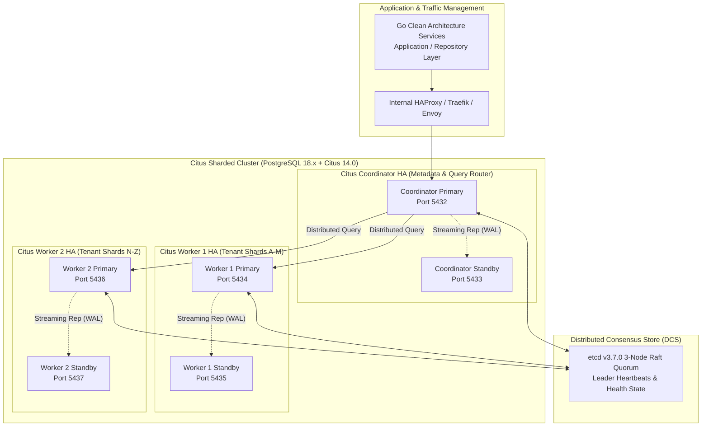
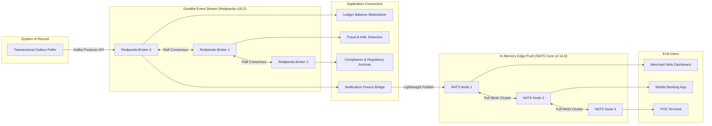
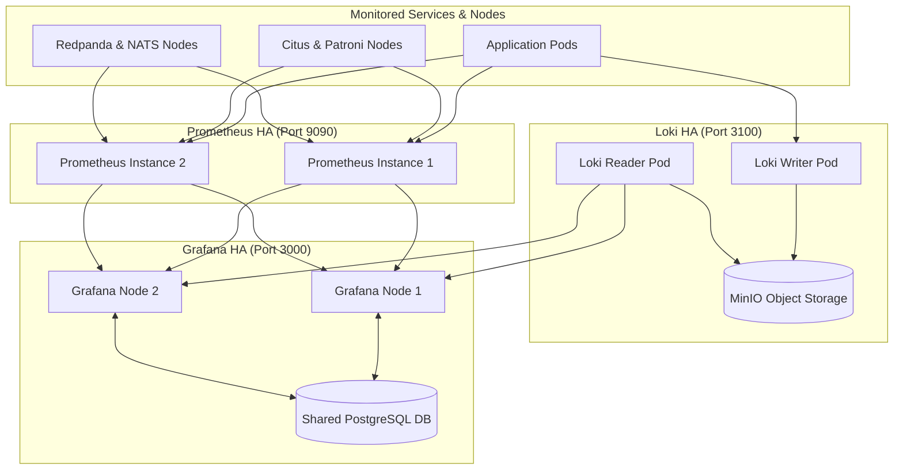

# Infrastructure Architecture & Persistence Guide

This document is the normative architectural reference for the Infrastructure layer (`internal/infrastructure/`), database lifecycle operations (`scripts/db/`, `cmd/seed/`), event outbox propagation, and test harnesses.

---

## 1. Core Persistence Principles: The Ledger as System of Record (SoR)

In a double-entry fintech platform, the relational database (PostgreSQL) is the authoritative **System of Record (SoR)**. 

### Synchronous Balance Validation vs. Asynchronous Queuing
* **The System of Record Guarantee**: Every state-changing financial mutation (authorizations, captures, transfers, refunds, hold placements) must verify business rules against strongly consistent, uncommitted row state.
* **Immediate Transactional Integrity**: When an API client submits a payment, the platform must synchronously answer:
  * `201 Created` / `200 OK` (Funds reserved/transferred)
  * `422 Unprocessable Entity` (Insufficient available balance)
  * `409 Conflict` (Concurrent in-flight idempotency clash)
* **Why Ledger Mutations Cannot Be "Queue-First"**:
  If incoming transfer requests are buffered in a queue (e.g. NATS) before hitting the database, the API can only return `202 Accepted` ("Request received, we'll try moving the money later"). This breaks point-of-sale authorizations, merchant checkouts, and introduces double-spending race conditions across competing transactions.

---

## 2. Event Delivery: The Transactional Outbox Pattern

To communicate state changes to downstream services (webhooks, merchant notifications, analytics, reporting read models) without introducing distributed consistency bugs, this repository mandates the **Transactional Outbox Pattern** (`internal/infrastructure/database/postgres/outbox`).

### The Dual-Write Problem
Attempting to write to a database and publish to a message broker in separate network calls creates an unsolvable distributed systems dilemma:
1. **DB Commit Succeeds, Publish Fails**: If the network blinks during the broker publish call, the money moved in PostgreSQL, but no event is ever emitted. Downstream webhooks, fraud monitoring, and emails are permanently lost.
2. **Publish Succeeds, DB Commit Fails**: If the event is sent before the DB commits, but the DB rolls back due to a constraint violation or lock conflict, downstream consumers process phantom transactions for money that never moved.

```mermaid
flowchart TD
    subgraph Direct Queue ["❌ Anti-Pattern: Direct Broker Publish (Dual-Write Bug)"]
        Req1[API Request] --> DB1[(PostgreSQL / Citus)]
        Req1 -. "Network Glitch? Event Lost!" .-> Redpanda1[Message Broker]
    end

    subgraph Outbox Pattern ["✅ Enforced Pattern: Transactional Outbox + Dual Broker"]
        Req2[API Request] --> Tx["Single ACID Transaction<br/>(1. Mutate Ledger + 2. Insert outbox_events)"]
        Tx --> WAL[(PostgreSQL WAL / Citus Worker WAL)]
        WAL --> Poller["Background Poller / Relay<br/>(SELECT ... FOR UPDATE SKIP LOCKED)"]
        Poller --> Redpanda2[Redpanda Cluster<br/>(Durable Kafka API Log)]
        Redpanda2 --> ConsumerApp[Application Consumers<br/>Audit, Ledger Balances, Fraud]
        ConsumerApp --> NATSMesh[NATS Core Mesh<br/>(In-Memory Pub/Sub)]
        NATSMesh --> WS[Edge WebSocket Push / Clients]
    end
```

### Outbox Mechanics in this Repository
1. **Atomic Insertion**: When `PostingRepository.Commit` or workflow services mutate entities, an event record is written to the `outbox_events` table **in the same database transaction**.
2. **Non-Blocking Polling**: The `outbox.Poller` queries unpublished rows using `SELECT ... FOR UPDATE SKIP LOCKED`. It never blocks incoming transaction writes and allows multiple concurrent outbox workers.
3. **Lease Timeout & Crash Recovery**: Workers claim batches with a configurable lease timeout (`ClaimTimeout = 60s`). If a worker crashes or loses network connectivity mid-dispatch, surviving workers automatically reclaim the expired lease and deliver the event without human intervention.
4. **At-Least-Once Delivery to Redpanda**: The outbox guarantees *at-least-once* delivery to Redpanda topic partitions. Downstream consumers must be idempotent (using the event's unique `id` or idempotency key).
5. **Real-Time Edge Broadcast via NATS Core**: Event notification consumers publish lightweight signals to NATS Core subjects, broadcasting sub-millisecond updates to live WebSocket subscribers.

---

## 3. Idempotency Keys vs. Concurrency Control (Double Spending)

A common misconception in distributed architecture is assuming that an **Idempotency Key** prevents **Double Spending**. They solve two completely different problems:

| Dimension | Idempotency Key | Concurrency Control (Row Locking) |
|---|---|---|
| **What Problem Does It Solve?** | **Identical retries of the SAME request** (e.g. user double-clicks submit, mobile network drops and retries packet). | **Competing DISTINCT requests** attempting to spend the same limited resource/balance at the same instant. |
| **Example Scenario** | User sends \$100 to Amazon once, client network times out and resends identical request `idem_123`. | User with \$100 in wallet sends \$100 to Amazon (`idem_1`) AND \$100 to Apple (`idem_2`) at the exact same millisecond. |
| **Result Without Protection** | Amazon gets paid \$200 (duplicate payment for single order). | User spends \$200 from a \$100 balance (Double Spend / negative balance). |
| **Resolution Mechanism** | Cache and replay the original response payload for identical `(tenant_id, key)`. | Pessimistic locking (`SELECT ... FOR UPDATE`) to serialize ledger access per account. |

### Why Idempotency Alone Cannot Protect a Queue-First Architecture
If an API buffers requests in a queue before writing to the database:
1. Two distinct requests arrive for a wallet with \$100:
   * Request A: \$100 to Merchant 1 (`key: req_a`)
   * Request B: \$100 to Merchant 2 (`key: req_b`)
2. Both keys are completely unique, so the queue accepts both. The API returns `202 Accepted` to both merchants.
3. Two worker consumers process the queue concurrently. Both see the initial balance is \$100.
4. Without synchronous database serialization, both deduct \$100, leaving the account at -\$100. Even with database locks, one worker fails asynchronously—after the API already promised `202 Accepted` to the customer!

Furthermore, **in-flight idempotency** requires synchronous database coordination:
* If Request 1 (`key: req_123`) is sitting in a queue waiting to be processed, and a retry Request 2 (`key: req_123`) arrives, the API cannot know if `req_123` is already executing unless it queries a shared, strongly consistent state store.
* Our architecture solves this by atomically **reserving** the idempotency key in PostgreSQL inside the initial transaction:
  ```sql
  INSERT INTO idempotency_keys (key, tenant_id, request_hash, state)
  VALUES ($1, $2, $3, 'PENDING')
  ```
  If a duplicate arrives while the first is in-flight, PostgreSQL's primary key constraint immediately rejects it with `409 Conflict`.

---

## 4. Distributed Relational Persistence: Citus Sharding & Flexible HA

To scale ledger transaction throughput beyond a single PostgreSQL primary node while preserving strict ACID consistency and foreign-key integrity, this platform adopts **Citus 14.0 distributed sharding** paired with a dual-profile High Availability (HA) orchestration engine.



### 4.1 Sharding Strategy: Co-Located Distributed Tables
Financial ledger integrity requires that account balances, journal entries, and postings are updated together atomically. Cross-worker distributed transactions (Two-Phase Commit / 2PC) add latency; therefore, tables are **co-located by `tenant_id`**:

```sql
-- Convert standard tables to distributed tables partitioned by tenant_id
SELECT create_distributed_table('accounts', 'tenant_id', colocate_with => 'none');
SELECT create_distributed_table('journal_entries', 'tenant_id', colocate_with => 'accounts');
SELECT create_distributed_table('postings', 'tenant_id', colocate_with => 'accounts');
SELECT create_distributed_table('idempotency_keys', 'tenant_id', colocate_with => 'accounts');

-- Reference tables replicated to ALL worker nodes for zero-network JOINs
SELECT create_reference_table('currencies');
SELECT create_reference_table('fee_schedules');
SELECT create_reference_table('country_codes');
```

* **Local Atomic Commits**: Because `accounts`, `journal_entries`, and `postings` for a given `tenant_id` share identical shard boundaries on the same physical worker node, ledger transfers execute as fast local PostgreSQL transactions.
* **GORM & Driver Compatibility**: Applications connect to the Citus Coordinator using the standard `pgx` driver and GORM. The application layer requires zero sharding logic.

### 4.2 Flexible HA Orchestration: Patroni vs. CloudNativePG

The platform supports two deployment profiles to accommodate bare-metal/VM and Kubernetes environments:

| Feature | Patroni v4.1.5 Profile (Bare-Metal / VM / Docker Compose) | CloudNativePG v1.30.0 Profile (Kubernetes Native) |
|---|---|---|
| **Consensus Store** | etcd v3.7.0 (3-node Raft quorum) | Kubernetes API server (`coordination.k8s.io` Leases) |
| **Failover Control** | Patroni daemon monitoring PostgreSQL health + etcd lease TTL (10s) | CloudNativePG controller monitoring Pod health + Instance Manager |
| **Split-Brain Guard** | etcd lease acquisition; node demotes itself if lease cannot be renewed | Kubernetes Lease lock + fencing (`Cluster` CRD) |
| **Backup & PITR** | `pgBackRest` / `WAL-G` shipping WALs to MinIO / S3 | Native Barman integration with S3/GCS/Azure Blob object store |
| **Replication Mode** | Synchronous streaming replication with automatic fallback to async | Declarative `minSyncReplicas: 1`, `maxSyncReplicas: 2` |

### 4.3 Why Citus + Flexible HA Over Alternatives
* **Why Citus instead of CockroachDB?** CockroachDB replaces PostgreSQL's query engine with distributed Raft per range. Under high-frequency concurrent writes to single accounts, CockroachDB throws serialization retry errors (`TransactionRetryError`) that force complex application retry logic. Citus preserves native PostgreSQL row-level pessimistic locking (`SELECT ... FOR UPDATE`), partial indexes, and GORM compatibility.
* **Why Citus instead of Vitess?** Vitess is MySQL-centric and restricts complex SQL features (window functions, recursive CTEs). Double-entry accounting heavily relies on PostgreSQL's rich relational semantics.

---

## 5. Dual-Broker Messaging Architecture: Redpanda + NATS Core

Fintech systems have two distinct messaging requirements that a single broker cannot satisfy without compromise:
1. **Durable, Replayable, Ordered Event Log**: Audit-grade financial events must never be lost, must retain strict per-partition ordering, and must support multi-day consumer replay.
2. **Sub-Millisecond Real-Time Edge Delivery**: Point-of-sale terminals, web dashboards, and mobile apps require ephemeral, low-latency WebSocket push notifications.



### 5.1 Redpanda v26.2: Raft-Native Event Streaming
* **Kafka API Compatibility**: Applications use standard Kafka client libraries (`segmentio/kafka-go` or `IBM/sarama`).
* **Zero JVM Overhead**: Written in C++ using Seastar asynchronous framework. Provides predictable tail latency (p99 < 5ms) without Java garbage collection pauses.
* **Built-in Raft Consensus**: Metadata and topic partitions use integrated Raft. Zero dependency on external Apache ZooKeeper or KRaft metadata controllers.
* **Primary Topics**:
  - `ledger.events.v1`: Financial postings, balance reservations, settlement executions.
  - `money-movement.transfers.v1`: External wire, ACH, and card payments.
  - `compliance.kyc.v1`: Tenant onboarding and verification state changes.

### 5.2 NATS Server v2.14.6: In-Memory Core Mesh
* **Pure In-Memory Pub/Sub**: Zero disk writes, sub-millisecond dispatch (<50µs latency).
* **Subject-Based Addressing**: Canonical subject hierarchies (via `E05-T03` key/subject builders) for fine-grained tenant isolation:
  - `ledger.{tenant_id}.account.balance.changed.v1`
  - `ledger.{tenant_id}.fraud.alert.v1`
* **Edge WebSocket Gateways**: NATS Core instances terminate secure client WebSockets directly, decoupling edge connection state from backend worker pools.

---

## 6. Multi-Tier Hybrid Caching: Otter (L1) + Valkey (L2)

High-frequency ledger reads (account existence verification, balance checks, tenant configurations, idempotency records) are accelerated via a two-tier hybrid cache:

```mermaid
flowchart TD
    Req[Application Read Request] --> L1{L1 Cache: Otter<br/>In-Memory W-TinyLFU}
    L1 -->|Hit (<50ns)| ReturnFast[Return In-Memory Value]
    L1 -->|Miss| L2{L2 Cache: Valkey Cluster<br/>Distributed Memory}
    L2 -->|Hit (<1ms)| PopulateL1[Populate Otter L1] --> ReturnFast
    L2 -->|Miss| DB[(Citus PostgreSQL Cluster)]
    DB --> PopulateL2[Populate Valkey L2] --> PopulateL1 --> ReturnFast
```

### 6.1 Otter v2.3.0 (L1 In-Memory Cache)
* **Adaptive W-TinyLFU Eviction**: Employs an adaptive Window TinyLFU algorithm with Caffeine-style architecture and BP-Wrapper lock-free read buffers. Outperforms traditional LRU and naive TinyLFU (Ristretto) by dynamically sizing the admission window and preventing cache pollution from one-off batch scans while guaranteeing immediate synchronous write visibility.
* **Go Generics**: Strongly typed API (`otter.Cache[string, Account]`), eliminating `interface{}` boxing allocations and runtime type assertions.
* **Per-Key TTL**: Dynamic expiration per entry, enabling immediate invalidation of financial state upon journal posting.
* **2-3x Throughput**: Up to 3x higher read/write concurrency than Ristretto and BigCache under heavy multi-goroutine contention.

### 6.2 Valkey v9.1.2 (L2 Distributed Cluster)
* **Open-Source Freedom**: Formed under the Linux Foundation to preserve 100% open-source BSD-3-Clause licensing following Redis's shift to proprietary SSPL/RSALv2.
* **Multi-Node Sentinel / Cluster**: 3-node master-replica topology with automatic failover via Valkey Sentinel.
* **Shared Invalidation Bus**: Pub/Sub invalidation channels broadcast eviction signals across distributed service pods when balances change.

---

## 7. Secrets Management & PCI-DSS Tokenization: OpenBao

Enterprise fintech operations require strict separation of secrets and hardware-backed cryptographic protection for cardholder data (PCI-DSS compliance):

```mermaid
flowchart LR
    subgraph AppPods ["Application Services"]
        Service[Fintech Ledger Service]
    end

    subgraph OpenBaoCluster ["OpenBao v2.6.2 HA Cluster (Raft Storage)"]
        Leader[OpenBao Leader<br/>Port 8200]
        Follower1[OpenBao Follower 1]
        Follower2[OpenBao Follower 2]
        Leader <-->|Raft Consensus| Follower1 <-->|Raft Consensus| Follower2
    end

    subgraph Engines ["OpenBao Secret Engines"]
        DBEngine[PostgreSQL Dynamic DB Engine]
        TransitEngine[Transit Cryptographic Engine]
    end

    subgraph Targets ["Secured Infrastructure"]
        Postgres[(PostgreSQL / Citus)]
        EncryptedDB[(Cardholder Data Table)]
    end

    Service -->|1. AppRole Auth| Leader
    Leader --> DBEngine
    DBEngine -->|2. Generate Ephemeral User (1h lease)| Postgres
    Leader -->|3. Return db_user / db_pass| Service

    Service -->|4. Encrypt PAN (Transit API)| TransitEngine
    TransitEngine -->|5. Return Tokenized Ciphertext| Service
    Service -->|6. Store Token| EncryptedDB
```

### 7.1 OpenBao v2.6.2 HA Cluster
* **100% Open-Source MPL-2.0**: Community-driven, vendor-neutral fork of HashiCorp Vault maintained under the Linux Foundation.
* **Integrated Raft Storage**: 3-node high-availability cluster with automatic leader election without external Consul dependencies.

### 7.2 Dynamic Database Credentials
* Application instances do not hold static database passwords.
* On startup, services authenticate to OpenBao via AppRole or Kubernetes Service Account tokens.
* OpenBao provisions short-lived PostgreSQL credentials (e.g. `v-token-app-123` with 1-hour lease).
* OpenBao automatically rotates and revokes expired credentials, mitigating credential-leak impact.

### 7.3 Transit Secret Engine: PCI-DSS PAN Tokenization
* **Primary Account Number (PAN) Encryption**: Sensitive card numbers never touch unencrypted memory or disk in plain text.
* **Encryption-as-a-Service**: Services call `POST /v1/transit/encrypt/fintech-ledger` passing plaintext PANs; OpenBao returns ciphertext tokens (`vault:v1:8x9F...`).
* **Cryptographic Erasure (GDPR)**: Deleting or rotating the encryption key inside OpenBao instantly renders all stored ciphertext permanently unreadable without complex table scrubs.

---

## 8. Distributed Coordination & Config Streaming: etcd

A robust distributed system requires a reliable, CP (Consistency / Partition tolerance) coordination plane:

```mermaid
flowchart TD
    subgraph etcdCluster ["etcd v3.7.0 3-Node Raft Cluster"]
        E1[etcd-1<br/>Port 2379/2380]
        E2[etcd-2<br/>Port 2379/2380]
        E3[etcd-3<br/>Port 2379/2380]
        E1 <-->|Raft Quorum| E2 <-->|Raft Quorum| E3
    end

    subgraph PatroniHA ["Database HA Plane"]
        PatPrimary[Patroni Primary] -->|Lease Heartbeat (10s TTL)| E1
        PatStandby[Patroni Standby] -->|Watch Primary Lease| E2
    end

    subgraph AppCoordination ["Application Plane"]
        AppInstances[Service Instances] -->|gRPC Watch: Dynamic Config| E1
        CronLeader[Cron Worker Leader Election] -->|Distributed Mutex| E3
    end
```

### 8.1 Key Responsibilities of etcd v3.7.0
1. **Patroni Distributed Consensus Store (DCS)**:
   - Primary PostgreSQL node holds an active lease key (`/service/citus/leader`) with a 10-second TTL.
   - If the primary crashes or network partitions, the lease expires. Standbys elect a new primary with zero split-brain risk.
2. **Dynamic Configuration Streaming**:
   - Application configuration (feature flags, rate limits, circuit breaker thresholds) is watched via gRPC streaming (`clientv3.Watch`).
   - Configuration changes take effect immediately across all cluster pods without container restarts.
3. **Distributed Worker Leader Election**:
   - High-throughput background processes (daily interest assessment, settlement batch generation) use etcd distributed locks (`concurrency.NewElection`) to guarantee single-leader execution across multi-pod deployments.

---

## 9. Observability & Monitoring Infrastructure in HA

Production observability must remain operational even during infrastructure incidents:



* **Prometheus v3.14.0 HA**: Dual independent Prometheus instances scrape identical targets. Alertmanager handles alert deduplication.
* **Grafana v13.0 HA**: Multiple stateless Grafana instances behind an ingress load balancer, persisting user dashboards, alerts, and sessions in PostgreSQL.
* **Loki v3.7.7 HA**: High-volume log aggregation using S3/MinIO chunk storage with separated ingest and query paths.
* **Tempo v2.9.4**: Distributed tracing backend storing trace blocks in MinIO / S3 object storage with sub-second lookups.

---

## 10. Complete Multi-Node Infrastructure Topology & Network Map

| Service | Node Count | Clustering / Replication Protocol | Client Port | Peer / Internal Port | Storage / Persistence Mode |
|---|---|---|---|---|---|
| **Citus Coordinator** | 2 (1 Primary, 1 Standby) | PostgreSQL Streaming Replication + Patroni DCS | `5432` | `5433` | Host-mounted NVMe / Persistent Volume |
| **Citus Workers** | 4 (2 Primaries, 2 Standbys) | PostgreSQL Streaming Replication + Patroni DCS | `5434`, `5436` | `5435`, `5437` | Co-located sharded tables per tenant |
| **etcd DCS** | 3 | Raft Consensus | `2379` | `2380` | Write-Ahead Log (WAL) + B-tree DB |
| **Redpanda** | 3 | Raft Consensus (Kafka API) | `9092` | `9093`, `33145` | Direct I/O NVMe Log segments |
| **NATS Core** | 3 | Full Mesh Gossip / Route Clustering | `4222` | `6222` | 100% In-Memory RAM |
| **Valkey** | 6 (3 Primaries, 3 Replicas) | Valkey Cluster (Production) / Standalone (Dev) | `6379` | `16379` | In-memory with Append-Only File (AOF) |
| **OpenBao** | 3 | Integrated Raft Storage | `8200` | `8201` | Raft-replicated encrypted storage |
| **Prometheus** | 2 | Dual scrape + Alertmanager deduplication | `9090` | - | Time-Series TSDB blocks |
| **Grafana** | 2 | Stateless HA with PostgreSQL Session DB | `3000` | - | Stateless |
| **Loki** | 2 | Microservices mode (Read/Write split) | `3100` | `9096` | MinIO / S3 distributed object store |
| **Tempo** | 1 | Distributed tracing backend | `4317` | `4318` | MinIO / S3 block storage |

### Deployment profiles (E07.1)

- **Profile A (Compose):** `deployments/docker/docker-compose.citus-patroni.yml` builds
  `deployments/patroni/Dockerfile` (Citus 14.0 + Patroni v4.1.5) for the coordinator
  (1 primary + 1 standby, `localhost:5432`) and two worker shards, supervised by the
  3-node etcd DCS; `citus-init` enables the extension and registers workers
  (verify with `SELECT nodename FROM pg_dist_node;`).
- **Profile B (Kubernetes):** `deployments/k8s/cloudnativepg/` (CNPG v1.30.0 Cluster CRs,
  backup stanza, worker-registration Job, NetworkPolicies).

---

## 11. Failure Scenarios & Self-Healing Drills

### Scenario A: Citus Coordinator Failure
1. The Citus Coordinator primary node crashes or loses network connectivity.
2. The 10-second etcd lease expires; Patroni on the standby node detects the missing lease.
3. The standby executes standby promotion, replaying outstanding WAL segments.
4. Traefik / HAProxy health checks detect port `5432` failover and redirect write traffic to the newly promoted coordinator.
5. In-flight transactions rollback cleanly via ACID isolation; application retries succeed against the new primary.

### Scenario B: Worker Node Partition During Distributed Query
1. A network partition isolates `citus-worker-2`.
2. The Coordinator's two-phase commit (2PC) detects an unresponsive worker and aborts the transaction before any partial state is finalized.
3. The client receives `503 Service Unavailable` or `409 Conflict`.
4. Patroni promotes `citus-worker-2-standby` to primary; the Coordinator reconnects and resumes queries without manual DBA intervention.

### Scenario C: Redpanda Broker Outage
1. One broker in the 3-node Redpanda cluster crashes.
2. Raft leader election occurs within 500ms for affected topic partitions across the remaining two nodes.
3. Outbox poller producers retry via exponential backoff; message delivery resumes automatically with zero event loss.

### Scenario D: OpenBao Dynamic Credential Expiry
1. An application instance suffers an unhandled exception or network disconnect during credential renewal.
2. The database user lease expires; PostgreSQL revokes privileges automatically.
3. The application's database connection pool detects authentication failure, requests a fresh lease from the OpenBao leader, and reconnects seamlessly.

---

## 12. Database Schema Evolution & Lifecycle: Pressly Goose v3 + Ariga Atlas (Hybrid Architecture)

In high-concurrency fintech platforms, distributed ledgers, and multi-tenant SaaS environments maintained by multiple engineering squads, schema migration tooling is a primary operational stability boundary. A failure in schema evolution can cause unrecoverable locks, service downtime, or data corruption.

This platform implements a **Hybrid Migration Architecture** pairing **Pressly Goose v3** (embedded runtime execution engine) with **Ariga Atlas** (CI pre-deployment safety linter and cryptographic Merkle tree verifier), governed by [ADR-018](../architecture/ADR-018-database-migrations-goose-and-atlas.md).

---

### 12.1 Operational Decoupling: Why Migrations & Seeding Are Decoupled from `main.go`

In small monolithic apps, engineers often run migrations on application boot (e.g., in `main.go` using `CREATE TABLE IF NOT EXISTS`). In high-concurrency fintech platforms, this is strictly prohibited for four operational and security reasons:

#### A. Horizontal Autoscaling & Schema Lock Contention
In Kubernetes, deployments spin up multiple replicas (5 to 50 pods) simultaneously:
* DDL operations (`ALTER TABLE`, `CREATE INDEX`, foreign key additions) acquire PostgreSQL **`ACCESS EXCLUSIVE`** locks.
* If multiple pods boot concurrently and attempt schema migrations:
  * Pods enter lock contention or lock-wait timeouts, triggering Kubernetes readiness probe failures (`CrashLoopBackOff`).
  * If live user traffic is actively querying the database while an app pod attempts DDL, query queues back up, exhausting the connection pool.

#### B. Principle of Least Privilege (Security & Compliance)
Fintech compliance standards (SOC 2, PCI-DSS, ISO 27001) require strict separation of database privileges:
* **Runtime Application Role (`app_user`)**: Restricted to Data Manipulation Language (DML: `SELECT`, `INSERT`, `UPDATE`). It **cannot** perform DDL (`DROP TABLE`, `ALTER TABLE`, `CREATE TABLE`).
  * If an application endpoint suffers a SQL injection vulnerability or remote code execution, the attacker cannot drop tables or alter security policies.
* **Migration Role (`postgres` / migration admin)**: Elevated administrative role required to run DDL.
  * Migrations run exclusively in a dedicated, ephemeral CI/CD deployment step or a single-shot Kubernetes `Job` using migration credentials. Migration credentials are never mounted inside runtime application containers.

#### C. Prevention of Accidental Seeding in Production
Development seeds populate dummy tenants (`tnt-test-01`), test accounts, and fake initial balances. Compiling seeding logic into the main service binary creates the constant risk that a misconfigured environment variable or developer flag could trigger dev seeding against staging or production databases. Decoupling seeding into `cmd/seed` and `scripts/db/seed.sh` guarantees seed code is never called by production servers.

#### D. Zero-Downtime Blue-Green / Canary Deployments (Expand/Contract)
During production rolling updates, `v1` and `v2` pods run side-by-side:
1. **Expand Phase**: Database migrations run *before* new code deploys. The schema is expanded in a backward-compatible manner (new nullable columns, additive tables). Both `v1` and `v2` pods can read/write successfully.
2. **Deploy Phase**: `v2` application pods roll out and serve traffic.
3. **Contract Phase**: A subsequent migration removes deprecated columns once `v1` pods are completely decommissioned.
Decoupled migration tooling gives the release pipeline explicit control over this multi-stage lifecycle.

---

### 12.2 Comprehensive Evaluation Matrix: Why Goose + Atlas Over Alternatives

We conducted a technical evaluation of database migration approaches:
- **`pressly/goose/v3`** (v3.28.0)
- **`ariga/atlas`** (CLI v1.3.0 community edition)
- **Bespoke stdlib runner + `golang-migrate` CLI** (previous baseline)
- **`dbmate`**

#### Comparative Evaluation Matrix

| Architectural Dimension | Bespoke stdlib runner | `golang-migrate` CLI | `dbmate` | `ariga/atlas` (Standalone) | **Hybrid: Goose v3 + Atlas (Selected)** |
| :--- | :--- | :--- | :--- | :--- | :--- |
| **Versioning Scheme** | Strict gapless integer (1..N) | Sequential integers | UTC timestamps | Declarative or timestamps | **Preserved 1..4 integers + 14-digit UTC timestamps (`YYYYMMDDHHMMSS`)** |
| **Concurrent Branch Immunity** | ❌ Fails; hard check `version != index+1` | ❌ Fails; dirty state on out-of-order | ⚠️ Executes, but no integrity manifest | ✅ Supported | **✅ Out-of-order execution (`-allow-missing`) + `atlas.sum` Merkle tree** |
| **Transaction Control / Pragmas** | ❌ Rigid; hardcoded `BeginTx` | ❌ Rigid; forces entire file into tx | ⚠️ Global per-file flag only | ✅ Supported in HCL/DDL | **✅ Granular statement annotations (`-- +goose NO TRANSACTION`, `StatementBegin/End`)** |
| **Citus Distributed DDL Support** | ❌ Fails on `create_distributed_table` | ❌ Fails on `create_distributed_table` | ⚠️ Shell-only workaround | ✅ Supported | **✅ Native support via non-transactional annotations** |
| **Non-Blocking Indexing** | ❌ Cannot run `CREATE INDEX CONCURRENTLY` | ❌ Cannot run `CREATE INDEX CONCURRENTLY` | ⚠️ Shell-only workaround | ✅ Supported | **✅ Seamless non-transactional execution** |
| **Go Library Embed (`embed.FS`)** | ✅ Supported (`io/fs`) | ✅ Supported (`io/fs`) | ❌ None (external binary only) | ⚠️ Go SDK complex/heavy | **✅ Native lightweight Go library (`goose.NewProvider`)** |
| **Programmatic `.go` Migrations** | ❌ Pure SQL only | ❌ Pure SQL only | ❌ Pure SQL only | ❌ HCL/SQL only | **✅ Native Go migration functions (`goose.AddMigrationContext`)** |
| **CI Safety Analysis & Linting** | ❌ None (blind executor) | ❌ None (blind executor) | ❌ None (blind executor) | ✅ Industry standard | **✅ Ariga Atlas CLI dev-container pre-deployment analysis** |
| **File Tamper Detection** | ❌ None | ❌ None | ❌ None | ✅ `atlas.sum` checksum file | **✅ Cryptographic Merkle tree verification (`atlas.sum`)** |
| **Regulatory & Financial Audit** | ✅ Explicit SQL files | ✅ Explicit SQL files | ✅ Explicit SQL files | ⚠️ Pure declarative diff abstracts change record | **✅ Explicit, immutable SQL scripts versioned in Git** |

#### Why the Custom Runner and `golang-migrate` Were Superseded
1. **The Custom stdlib Runner (`migrate.go`) Bottlenecks**:
   - The repository's service runtime relied on a ~310-line stdlib runner maintaining its own `schema_migrations` table (`version INTEGER, applied_at TIMESTAMPTZ`).
   - It hardcoded transaction wrapping (`tx, err := r.db.BeginTx(ctx, nil)`) around every migration. PostgreSQL and Citus **strictly forbid** running Citus sharding commands (`SELECT create_distributed_table(...)`) or non-blocking index creation (`CREATE INDEX CONCURRENTLY`) inside transaction blocks.
   - It enforced strict gapless sequential numbering (`version != index+1`). When multiple feature branches merge out of order, the runner errors out, blocking service deployment.
   - It lacked statement delimiter parsing (`StatementBegin/End`), breaking on complex PL/pgSQL stored procedures or triggers.
2. **The Dual-Runner CLI Disconnect**:
   - `scripts/db/migrate.sh` invoked the external `golang-migrate` CLI, creating an operational impedance mismatch where script-level tooling and in-process execution maintained different conventions on the same database.
3. **The Solution**: Replacing both with **Pressly Goose v3** establishes a unified, embeddable Go library and CLI with granular transaction control and out-of-order execution, while **Ariga Atlas** adds automated CI safety analysis and cryptographic Merkle tree integrity.

#### Why `dbmate` Was Not Selected
`dbmate` is a capable language-agnostic CLI tool, but unsuited for our Go Clean Architecture template:
1. **No First-Class Embeddable Go Library**: `dbmate` is strictly an external binary CLI written in Go, but does not provide an idiomatic Go library API. It cannot be embedded in `cmd/` entry points or executed in-process within Testcontainers integration tests.
2. **No Safety Linting**: It blindly runs SQL statements without verifying whether an index locks live traffic or an `ALTER TABLE` rewrites a 100M-row ledger table.

#### Why Standalone Declarative `ariga/atlas` Was Not Chosen as Pure Engine
Ariga Atlas pioneered schema-as-code and migration safety linting:
1. **Audit & Regulatory Compliance**: Regulated financial institutions (PCI-DSS 6.4, SOX 404 ITGC) require **explicit, human-reviewed, immutable, version-controlled SQL files**. Pure declarative schema synchronization (where Atlas calculates and applies dynamic diffs on the fly) abstracts away the historical audit trail.
2. **The Ideal Synthesis**: Pairing **Goose v3** (for explicit, auditable, embeddable SQL execution) with **Atlas CLI** (for pre-deployment safety linting and Merkle tree validation) delivers both rigorous safety and uncompromised regulatory auditability!

---

### 12.3 History Preservation, UTC Timestamps & Ledger Bootstrap

To eliminate merge conflicts across concurrent engineering branches while strictly honoring migration immutability:
```
internal/infrastructure/database/migration/versions/
├── 20260901000001_ledger_core.sql
├── 20260901000002_idempotency_outbox.sql
├── 20260901000003_workflow_tenancy_recon.sql
├── 20260901000004_rls_policies.sql
├── 20260901000005_citus_distribution.sql
└── atlas.sum
```

1. **Timestamped Versions, No Legacy Numbers**:
   - All migration files use 14-digit UTC timestamps (`YYYYMMDDHHMMSS_<name>.sql`); the pre-release `000001`–`000004` baseline was renamed once per owner directive (zero deployed databases) so no incrementing names remain.
   - Goose parses every numeric prefix as an integer version and applies them in ascending order.
   - All future migrations use 14-digit UTC timestamps. The validator rejects bad names, legacy gaps (for any residual 6-digit files), and duplicate versions.

2. **Automatic One-Time Ledger Bootstrap**:
   Existing databases in development and staging have a `schema_migrations` table with rows `1..4`. When Goose initializes, `NewRunner` executes a one-time bootstrap copying applied versions into `goose_db_version`:
   ```sql
   CREATE UNIQUE INDEX IF NOT EXISTS goose_db_version_version_id_idx ON goose_db_version (version_id);
   INSERT INTO goose_db_version (version_id, is_applied)
   SELECT sm.version, true
   FROM schema_migrations sm
   WHERE NOT EXISTS (
       SELECT 1 FROM goose_db_version gv WHERE gv.version_id = sm.version
   );
   ```
   This guarantees that existing databases seamlessly upgrade to Goose without re-running historical migrations and ensures strict idempotency across multi-pod restarts.

3. **Out-of-Order Execution (`-allow-missing`)**:
   When Squad A creates `20260918100000_add_webhooks.sql` and Squad B creates `20260918110000_add_fx.sql`:
   * If Squad B merges first, `20260918110000` applies.
   * When Squad A merges later, Goose detects the earlier timestamp (`20260918100000`), applies it safely via `goose.WithAllowOutofOrder(true)` / `-allow-missing`, and registers it in `goose_db_version`.
   * The pipeline experiences **zero merge conflicts and zero dirty lockouts**.

---

### 12.4 Distributed DDL & Citus Sharding Mechanics (`-- +goose NO TRANSACTION`)

PostgreSQL and Citus enforce strict transaction rules:
* `SELECT create_distributed_table(...)` cannot execute inside a multi-statement transaction block because it coordinates distributed 2PC catalogs across coordinator and worker nodes.
* `CREATE INDEX CONCURRENTLY` cannot run inside a transaction block (`ERROR: CREATE INDEX CONCURRENTLY cannot run inside a transaction block`).

Goose provides the `-- +goose NO TRANSACTION` directive, which must be placed at the top of the file:
```sql
-- +goose NO TRANSACTION
-- +goose Up
SELECT create_distributed_table('ledger_entries', 'account_id');
CREATE INDEX CONCURRENTLY idx_entries_created_at ON ledger_entries (created_at);

-- +goose Down
DROP INDEX CONCURRENTLY IF EXISTS idx_entries_created_at;
```

For stored procedures, triggers, and anonymous `DO $$ ... $$` blocks, Goose uses explicit statement delimiters:
```sql
-- +goose Up
-- +goose StatementBegin
CREATE OR REPLACE FUNCTION enforce_balanced_posting()
RETURNS trigger AS $$
BEGIN
    -- Validation logic
    RETURN NEW;
END;
$$ LANGUAGE plpgsql;
-- +goose StatementEnd
```

---

### 12.5 Go Migration Usage Policy: Pure-Compute vs. Decoupled Service Backfills

Goose supports programmatic Go migrations (`goose.AddMigrationContext`), but executing arbitrary Go code during database migrations introduces severe operational risks if misused. This repository enforces a strict **Go Migration Usage Policy**:

1. **Pure-Compute Only in Migration DDL**:
   - Programmatic Go migrations are permitted **strictly for deterministic in-process computational logic** (e.g., in-memory numeric recalculations, re-encoding data structures, or parsing legacy binary blobs) executing purely on local CPU and standard SQL.
2. **External Network Calls Strictly Prohibited**:
   - Migrations MUST NEVER call external network services (such as OpenBao Transit encryption, external payment APIs, or message brokers).
   - Network calls during deployment migrations cause connection pool starvation, transaction timeouts, and deployment failures if the external service is slow or unreachable.
3. **Decoupled Asynchronous Backfills in Epic E14**:
   - Any sensitive data backfill requiring external services (such as OpenBao Transit envelope encryption backfills in Epic E09) MUST be implemented as an asynchronous, chunked, idempotent background worker job in **Epic E14** (`cmd/worker` or `cmd/cron`).
   - Background jobs execute outside deployment DDL, tracking progress via checkpoints, rate-limiting throughput, and enabling non-disruptive resumption.

---

### 12.6 Ariga Atlas Pre-Deployment Safety Linter & Merkle Tree Integrity (`atlas.sum`)

Atlas functions as our **pre-deployment CI safety gate**:

1. **Cryptographic Immutability (`atlas.sum`)**:
   Atlas tracks all migration files in a Merkle tree manifest (`atlas.sum`). If a developer accidentally modifies a previously merged migration file, `atlas migrate validate` immediately fails in CI with a hash mismatch error, preventing schema drift across environments.

2. **Pre-Deployment Safety Analysis (`atlas migrate lint`)**:
   In CI, Atlas boots an ephemeral PostgreSQL container, applies the migration history, and analyzes proposed changes against production safety policies:
   * **Table Rewrites**: Detects `ALTER TABLE ... ALTER COLUMN TYPE` or non-nullable column additions without defaults that would acquire an `ACCESS EXCLUSIVE` lock on massive tables.
   * **Lock Contention**: Detects `CREATE INDEX` executed without `CONCURRENTLY`.
   * **Destructive Operations**: Warns against accidental `DROP TABLE` or `DROP COLUMN` that would result in irreversible data loss.

---

### 12.7 Runtime Architecture & Separation of Responsibilities

The migration engine is encapsulated in `internal/infrastructure/database/migration/migrate.go`:
* **`Runner`**: Wraps `goose.Provider` using standard Go library interfaces (`database/sql`, `io/fs`).
* **Clean Architecture Isolation**: Zero Goose dependencies leak into the domain or application layers.
* **Separation of Duties**:
  * **Atlas CLI**: Runs exclusively in **pre-commit** and **CI PR pipelines** (`make migrate-lint`) to guarantee safety and integrity.
  * **Goose v3**: Runs at **deployment time** (via Kubernetes migration job or `scripts/db/migrate.sh`) and within **Testcontainers integration test suites** to apply validated DDL.

---

## 13. Operational Scripting Suite (`scripts/db/`)

The repository provides automated, hardened operational scripts for database lifecycle management:

| Script | Purpose | Safeguards |
|---|---|---|
| `scripts/db/migrate.sh` | Applies, rolls back, inspects, creates, or lints migrations using Pressly Goose v3 and Ariga Atlas. | Advisory locking, 14-digit UTC timestamps, out-of-order execution, `atlas.sum` integrity checks, and ephemeral container linting. |
| `scripts/db/seed.sh` | Migrates up and applies deterministic development seed data via `cmd/seed`. | Evaluates `-h`/`--help` without requiring database connection. |
| `scripts/db/reset.sh` | Drops `public` schema, re-applies all migrations from version 1, and seeds dev data. | **Production guard**: Refuses to run against URLs containing `prod`, `amazonaws.com`, or `cloudsql` unless `--force` is passed. |
| `scripts/db/backup.sh` | Generates compressed `.dump` archive (`pg_dump -Fc`) and captures WAL pointers for Point-In-Time Recovery. | Evaluates help before requiring database; writes timestamped dumps. |
| `scripts/db/restore.sh` | Restores a `.dump` archive into a target scratch database. | Refuses to write to the source database; requires explicit scratch destination. |
| `scripts/db/verify-restore.sh` | Automated disaster-recovery drill: boots/connects to a scratch DB, restores dump, checks row counts and connectivity. | Proves RTO/RPO targets are achievable; alerts on backup corruption. |

---

## 14. Test Fixture Parity (`test/fixtures`)

To prevent test fragmentation, `test/fixtures` serves as the **Single Source of Truth (SSOT)** for test constants and builders:
* **Canonical Identifiers**: `DefaultTenantID = "tnt-test-01"`, `DefaultLedgerID = "ldg-test-01"`, `AcctOperatingUSD`, `AcctFeeUSD`, `PostingTransfer01`.
* **Zero Production Contamination**: `test/fixtures` lives strictly outside `internal/`. Production packages never import test helpers.
* **Deterministic Parity**: The development seed plan (`database/seed`) and `test/fixtures` mirror identical entities. This parity is enforced by automated unit tests (`TestSeedMatchesFixtureIDs`).

---

## 15. Integration Testing & CI Roadmap

### Current CI State
The initial foundation pipeline (`.github/workflows/ci.yml`) executes:
```yaml
- name: Run race-detector test suite
  run: go test -race -count=1 ./...
```
Because GitHub Actions (`ubuntu-latest`) provides a live Docker daemon, Testcontainers executes live PostgreSQL 18.6 integration suites during this step.

### Future Delivery Pipeline (Epic E17 & SPEC §11.1)
To optimize PR feedback times and isolate cold container startup overhead, Epic E17 will separate the pipeline into distinct, independent stages:
1. **`lint` Gate**: Strict `golangci-lint` + `shellcheck` (~10s).
2. **`test-unit` Gate**: Pure in-memory unit tests via `./scripts/test/unit.sh` (<3s, zero Docker dependencies, fails fast on PRs).
3. **`test-integration` Gate**: Dedicated containerized job running Testcontainers with Docker layer caching for `citus:14.0`, `valkey`, `redpanda`, and `nats`.
4. **`test-contract` Gate**: Consumer-driven contracts (Pact, Protobuf breaking change detection via `buf`).
5. **`security` & `sbom`**: `govulncheck`, `gosec`, `syft`, and `trivy` container scanning.

