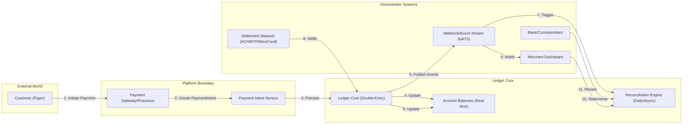

# Fintech Ledger - Money Flow Design

**Version:** 1.0.0  
**Status:** Design Phase  
**Related:** [Ledger Core](./ledger-core.md), [User Journeys](./user-journeys.md), [Data Flow](./data-flow.md), [Feature Spec](./fintech-ledger-features.md)

> **Normative note:** Journal semantics, amount representation, balance authority,
> and idempotency follow `ledger-core.md`. The examples below describe workflows;
> if a workflow is simplified, the ledger-core contract still applies.
>
> Amounts in narrative tables/diagrams may use major-unit display notation for
> readability. Implementation fields and API requests use checked integer
> `amount_minor` values with an explicit currency/asset code.

---

## 1. Money Flow Overview



**Note:** Detailed ASCII sequence diagrams for each flow pattern follow below. For best viewing, use a mermaid-compatible viewer.

---

## 2. Core Money Flow Patterns

### 2.1 Inbound Payment Flow (Customer → Merchant)

```
Customer                    Platform                        Ledger
   │                          │                              │
   │ 1. Initiate Payment      │                              │
   │─────────────────────────▶│                              │
   │                          │ 2. Create PaymentIntent      │
   │                          │─────────────────────────────▶│
   │                          │ 3. Reserve durable key +     │
   │                          │    request fingerprint (DB)  │
   │                          │◀─────────────────────────────│
   │                          │ 4. Return Client Token       │
   │◀─────────────────────────│                              │
   │                          │                              │
   │ 5. Present Payment UI    │                              │
   │◀─────────────────────────│                              │
   │                          │                              │
   │ 6. Submit Payment Details│                              │
   │─────────────────────────▶│                              │
   │                          │ 7. Forward to Processor      │
   │                          │─────────────────────────────▶│
   │                          │                              │
   │                          │ 8. Processor Authorizes      │
   │                          │◀─────────────────────────────│
   │                          │                              │
   │                          │ 9. Update PaymentIntent     │
   │                          │    workflow (not a journal)  │
   │                          │─────────────────────────────▶│
   │                          │ 10. Validate capture/posting │
   │                          │     template + provider fact │
   │                          │◀─────────────────────────────│
   │                          │ 11. Post immutable Posting  │
   │                          │     DR Processor Receivable  │
   │                          │     CR Merchant Payable      │
   │                          │     CR Fee Revenue           │
   │                          │◀─────────────────────────────│
   │                          │ 12. Update Balances          │
   │                          │◀─────────────────────────────│
   │                          │ 13. Publish Event            │
   │                          │─────────────────────────────▶│
   │                          │                              │
   │ 14. Payment Success      │                              │
   │◀─────────────────────────│                              │
   │                          │                              │
   │                          │ 15. Webhook to Merchant      │
   │                          │─────────────────────────────▶│
```

**Capture posting for $100.00 with a $2.90 platform fee:**
| Entry | Account | Class | Debit | Credit |
|-------|---------|-------|------:|-------:|
| 1 | Processor Receivable | ASSET | $100.00 | — |
| 2 | Merchant Payable: Pending | LIABILITY | — | $97.10 |
| 3 | Processing Fee Revenue | REVENUE | — | $2.90 |

Authorization alone creates/updates a hold and does not post a journal. Provider
settlement later debits Bank Cash and credits Processor Receivable. Availability
is a balance-dimension transition governed by the rail's settlement policy.

---

### 2.2 Outbound Payout Flow (Merchant → Bank Account)

```
Merchant                    Platform                        Ledger
   │                          │                              │
   │ 1. Request Payout        │                              │
   │─────────────────────────▶│                              │
   │                          │ 2. Lock account; atomically  │
   │                          │    create payout + durable   │
   │                          │    outbound hold              │
   │                          │    (SufficientFunds in tx)   │
   │                          │─────────────────────────────▶│
   │                          │◀─────────────────────────────│
   │                          │ 3. Commit PENDING record      │
   │                          │     with the hold linked       │
   │                          │─────────────────────────────▶│
   │                          │                              │
   │                          │ 4. Submit to ACH/RTP Network │
   │                          │─────────────────────────────▶│
   │                          │                              │
   │                          │ 5. Network Accepts           │
   │                          │◀─────────────────────────────│
   │                          │                              │
   │                          │ 6. Capture hold + post       │
   │                          │    submission entry           │
   │                          │     DR Merchant Payable      │
   │                          │     CR Payouts Payable       │
   │                          │─────────────────────────────▶│
   │                          │                              │
   │                          │ 7. Update Status → IN_TRANSIT│
   │                          │─────────────────────────────▶│
   │                          │                              │
   │                          │ 8. Bank Settles (T+1/T+2)    │
   │                          │◀─────────────────────────────│
   │                          │                              │
   │                          │ 9. Final Settlement Entry    │
   │                          │     DR Payouts Payable       │
   │                          │     CR Bank Cash             │
   │                          │─────────────────────────────▶│
   │                          │                              │
   │ 10. Payout Complete      │                              │
   │◀─────────────────────────│                              │
```

---

### 2.3 Internal Transfer Flow (Account A → Account B)

```
User/System                 Platform                        Ledger
   │                          │                              │
   │ 1. POST /transfers       │                              │
   │    {from_account_id,     │                              │
   │     to_account_id,       │                              │
   │     amount_minor, currency,│                            │
   │     idempotency_key}     │                              │
   │─────────────────────────▶│                              │
   │                          │ 2. BEGIN TRANSACTION         │
   │                          │─────────────────────────────▶│
   │                          │ 3. Reserve durable key +     │
   │                          │     request fingerprint      │
   │                          │ 4. SELECT FOR UPDATE in      │
   │                          │     deterministic ID order  │
   │                          │─────────────────────────────▶│
   │                          │ 5. Validate Specs            │
   │                          │     - SufficientFunds(from,  │
   │                          │       amount_minor, currency)│
   │                          │     - AccountActive(from/to) │
   │                          │     - ValidCurrency(from,to) │
   │                          │     - durable key claim/replay│
   │                          │◀─────────────────────────────│
   │                          │ 6. INSERT immutable Posting  │
   │                          │     (type=TRANSFER)          │
   │                          │ 7. INSERT Entries            │
   │                          │     DR source liability      │
   │                          │     CR destination liability │
   │                          │ 8. INSERT checkpoints,       │
   │                          │     outbox + idem response   │
   │                          │ 9. COMMIT                    │
   │                          │─────────────────────────────▶│
   │                          │ 10. Outbox publishes event   │
   │                          │     at least once            │
   │                          │─────────────────────────────▶│
   │ 12. Transfer Complete    │                              │
   │◀─────────────────────────│                              │
```

---

### 2.4 Refund Flow (Reversal)

```
Merchant                    Platform                        Ledger
   │                          │                              │
   │ 1. POST /refunds         │                              │
   │    {transaction_id,       │                              │
   │     amount_minor, currency,│                            │
   │     reason}               │                              │
   │─────────────────────────▶│                              │
   │                          │ 2. Reserve durable key +     │
   │                          │    persist REFUND_PENDING    │
   │                          │─────────────────────────────▶│
   │                          │ 3. Validate Refund Specs     │
   │                          │     - OriginalExists         │
   │                          │     - Amount <= Original     │
   │                          │     - WithinRefundWindow     │
   │                          │     - AccountActive          │
   │                          │─────────────────────────────▶│
   │                          │◀─────────────────────────────│
   │                          │ 4. Call Payment Processor    │
   │                          │    with provider idempotency │
   │                          │     Refund API               │
   │                          │─────────────────────────────▶│
   │                          │                              │
   │                          │ 5. Processor confirms or     │
   │                          │    returns UNKNOWN outcome   │
   │                          │◀─────────────────────────────│
   │                          │                              │
   │                          │ 6. On confirmed success, post│
   │                          │    refund liability           │
   │                          │     DR Merchant Payable      │
   │                          │     CR Refunds Payable       │
   │                          │─────────────────────────────▶│
   │                          │ 7. Insert checkpoint/outbox  │
   │                          │◀─────────────────────────────│
   │                          │ 8. Link to Original Posting  │
   │                          │     (reversal_of_txn_id)     │
   │                          │─────────────────────────────▶│
   │ 9. Refund Complete/      │                              │
   │    status lookup needed  │                              │
   │◀─────────────────────────│                              │
```

**Refund acceptance posting:**
| Entry | Account | Class | Debit | Credit | Reference |
|-------|---------|-------|------:|-------:|-----------|
| 1 | Merchant Payable | LIABILITY | $50.00 | — | refund_of:txn_123 |
| 2 | Refunds Payable | LIABILITY | — | $50.00 | refund_of:txn_123 |

Customer settlement separately debits Refunds Payable and credits Bank Cash or
Processor Receivable. The original posting remains immutable.

---

### 2.5 Fee Collection Flow

```
Platform                    Ledger
   │                          │
   │ 1. Calculate Fees        │
   │    (per transaction,     │
   │     monthly, per tenant) │
   │                          │
   │ 2. POST /fee-collection  │
   │    {tenant_id, period,   │
   │     fee_items[]}         │
   │─────────────────────────▶│
   │                          │ 3. For each fee item:
   │                          │    a. Validate AccountActive
   │                          │    b. Validate SufficientFunds
   │                          │    c. POST Transfer
   │                          │       DEBIT: Tenant Operating
   │                          │       CREDIT: Platform Revenue
   │                          │─────────────────────────────▶│
   │                          │ 4. Batch in single txn       │
   │                          │    (atomic, all-or-nothing)  │
   │                          │─────────────────────────────▶│
   │                          │ 5. Publish FeeCollected      │
   │                          │─────────────────────────────▶│
```

---

### 2.6 Interest Accrual Flow (Scheduled)

```
Cron (Daily)                Ledger
   │                          │
   │ 1. Trigger Accrual       │
   │    Workflow              │
   │─────────────────────────▶│
   │                          │ 2. SELECT interest-bearing
   │                          │    accounts (SAVINGS, LOAN)
   │                          │─────────────────────────────▶│
   │                          │ 3. For each account:
   │                          │    a. Calculate daily interest with
   │                          │       fixed-point/declared rounding
   │                          │    b. POST the approved template:
   │                          │       asset/savings interest:
   │                          │         DEBIT: Account (asset)
   │                          │         CREDIT: Interest Income
   │                          │       liability/deposit interest:
   │                          │         DEBIT: Interest Expense
   │                          │         CREDIT: Account (liability)
   │                          │─────────────────────────────▶│
   │                          │ 4. Batch commit              │
   │                          │    (single transaction)      │
   │                          │─────────────────────────────▶│
   │                          │ 5. Publish InterestAccrued   │
   │                          │─────────────────────────────▶│
```

---

### 2.7 Multi-Currency Flow with FX

```
Customer (EUR)              Platform                        Ledger
   │                          │                              │
   │ 1. Pay 100 EUR           │                              │
   │    Merchant in USD       │                              │
   │─────────────────────────▶│                              │
   │                          │ 2. Fetch FX Rate (EUR/USD)   │
   │                          │    Valkey Cache → FX Service │
   │                          │    Rate: 1.0850              │
   │                          │─────────────────────────────▶│
   │                          │ 3. Calculate Settlement      │
   │                          │    100 EUR × 1.0850 = $108.50│
   │                          │─────────────────────────────▶│
   │                          │ 4. Post Entries:             │
   │                          │    EUR lot (balanced):       │
   │                          │      DR Processor Rec 100    │
   │                          │      CR FX Position 100      │
   │                          │    USD lot (balanced):       │
   │                          │      DR FX Position 108.50   │
   │                          │      CR Merchant Payable     │
   │                          │─────────────────────────────▶│
```

**FX Gain/Loss Tracking:**
- Every currency lot balances independently and shares one `fx_trade_id`/rate snapshot
- Separate REVENUE/EXPENSE accounts for FX differences
- Realized when settlement occurs at different rate than authorization
- Configurable: mark-to-market (daily) or realized-only

**Minor units + zero-decimal currencies (constrains ADR-002):**
- All amounts stored as integer minor units; floats forbidden everywhere.
- Per-currency exponent table (USD/EUR/IDR=2, JPY/KRW/VND=0, BHD/KWD=3);
  constructing Money with a fractional minor unit fails validation.
- Conversion rounds half-even per unit, then §2.13 allocates any remainder.

---

### 2.8 Scheduled Transfer Flow (Future-Dated / Recurring)

```
User/System                 Platform                        Ledger
   │                          │                              │
   │ 1. POST /transfers       │                              │
   │    {from_account_id,     │                              │
   │     to_account_id,       │                              │
   │     amount_minor, currency,│                            │
   │     execute_at,          │                              │
   │     recurrence}          │                              │
   │─────────────────────────▶│                              │
   │                          │ 2. Validate identity, scope,  │
   │                          │    currency and schedule; do  │
   │                          │    not move funds yet          │
   │                          │─────────────────────────────▶│
   │                          │ 3. INSERT scheduled_transfer  │
   │                          │    (PENDING, execute_at,      │
   │                          │     idempotency_key); an       │
   │                          │    optional policy hold is      │
   │                          │    created atomically here     │
   │                          │─────────────────────────────▶│
   │                          │                              │
   │                          │ 4. Cron picks up due items    │
   │                          │    (gocron + Valkey Redlock)  │
   │                          │─────────────────────────────▶│
   │                          │ 5. Execute as 2.3 transfer    │
   │                          │    (full spec validation +   │
   │                          │     double-entry posting)     │
   │                          │─────────────────────────────▶│
   │                          │ 6a. Success → status=EXECUTED │
   │                          │ 6b. InsufficientFunds →       │
   │                          │     status=FAILED, notify,    │
   │                          │     optional retry policy     │
   │                          │─────────────────────────────▶│
```

**Rules:**
- By default, scheduled transfers do not reserve or move funds at creation;
  `SufficientFunds` and a durable reservation are enforced atomically at
  execution. A product policy may reserve at schedule time, but must lock the
  account and create the hold in the same transaction.
- Recurrence (`daily`, `weekly`, `monthly`) expands into child scheduled transfers sharing the parent idempotency root (`{root}:{occurrence}`).
- Cancel allowed while `PENDING`; executed transfers follow the reversal flow (§2.4).
- Transfer Templates (P2) are stored parameter sets (`from_account_id`,
  `to_account_id`, `amount_minor`, `currency`, `reference`) that pre-fill this flow.

---

### 2.9 Bulk Transfer Flow (Batch, Async)

```
User/System                 Platform                        Ledger
   │                          │                              │
   │ 1. POST /transfers/batch │                              │
   │    {items[≤1000],        │                              │
   │     batch_idempotency}   │                              │
   │─────────────────────────▶│                              │
   │                          │ 2. Validate file/items        │
   │                          │    (schema, currencies,       │
   │                          │     account existence)        │
   │                          │─────────────────────────────▶│
   │                          │ 3. INSERT batch (PENDING) +   │
   │                          │    N item rows (PENDING)      │
   │                          │─────────────────────────────▶│
   │                          │ 4. NATS: transfer.batch.      │
   │                          │    received.v1 (fan-out)      │
   │                          │─────────────────────────────▶│
   │                          │ 5. Consumer group processes   │
   │                          │    items in parallel, each as │
   │                          │    2.3 transfer with item     │
   │                          │    idempotency key            │
   │                          │    ({batch}:{index})          │
   │                          │─────────────────────────────▶│
   │                          │ 6. Aggregate: batch status =  │
   │                          │    COMPLETED / PARTIAL /      │
   │                          │    FAILED + per-item results  │
   │                          │─────────────────────────────▶│
   │                          │ 7. Webhook: transfer.batch.   │
   │                          │    completed (summary)        │
   │                          │─────────────────────────────▶│
```

**Rules:**
- Items are **independent**: one item's failure never rolls back siblings (no cross-item atomicity).
- Batch is atomic only at intake (all items accepted or batch rejected).
- Per-item idempotency keys make retries and replays safe.
- Partial completion returns `207 Multi-Status` semantics via the batch status endpoint.

---

### 2.10 Destination Charges + Application Fees (Connect-style Platform Split)

```
Customer            Platform                        Connected Merchant
   │                   │                                    │
   │ 1. Pay $100       │                                    │
   │──────────────────▶│                                    │
   │                   │ 2. Charge $100 on platform         │
   │                   │    + $2.90 application fee         │
   │                   │─────────────────────────────▶│     │
   │                   │ 3. Capture posting:                │
   │                   │    DR Processor Receivable $100.00 │
   │                   │    CR Merchant Payable $97.10      │
   │                   │    CR Platform Revenue $2.90       │
   │                   │─────────────────────────────▶│     │
   │                   │ 4. Make merchant liability         │
   │                   │    available under settlement      │
   │                   │    policy; payout is a later flow  │
   │                   │─────────────────────────────▶│     │
```

**Rules:**
- The application fee is carved out **at charge time** (never netted later).
- Settlement to the connected account happens in its currency/region (FX via §2.7 if different).
- Refund allocation and fee refund are explicit policy/provider results. Processor,
  platform, and application fees are not assumed to reverse proportionally.

---

### 2.11 Dispute Lifecycle (Chargeback)

```
Network               Platform                        Ledger
   │                     │                              │
   │ 1. dispute.opened   │                              │
   │────────────────────▶│                              │
   │                     │ 2. Create durable hold for   │
   │                     │    disputed amount (no entry) │
   │                     │    and post the dispute fee   │
   │                     │    with an approved template  │
   │                     │─────────────────────────────▶│
   │                     │ 3. Evidence due (network     │
   │                     │    deadline, e.g. 7–21 days) │
   │                     │    webhook: dispute.*        │
   │                     │─────────────────────────────▶│
   │                     │ 4a. WON → release hold,      │
   │                     │     reverse fee, close       │
   │                     │ 4b. LOST → convert hold to   │
   │                     │     reversal entries (like   │
   │                     │     §2.4) linked by          │
   │                     │     reversal_of_txn_id       │
   │                     │─────────────────────────────▶│
```

**Rules:**
- The hold and fee posting are created atomically at open; the hold itself is
  not a journal entry. Dispute windows are network-config-driven (e.g., Visa
  120 days); late disputes are rejected.
- Fraud early warnings auto-refund when the refund cost < expected dispute cost + fee.
- Representment stages/count and evidence rules come from versioned network policy.

---

### 2.12 Authorization + Capture (Separate Steps)

```
Customer              Platform                        Ledger
   │                     │                              │
   │ 1. Authorize $100   │                              │
   │────────────────────▶│                              │
   │                     │ 2. HOLD $100 (no movement)   │
   │                     │    status = AUTHORIZED       │
   │                     │    auth_expires_at = +7d     │
   │                     │─────────────────────────────▶│
   │                     │ 3a. Capture $80 (partial)    │
   │                     │     DEBIT/CREDIT $80,        │
   │                     │     release $20 hold         │
   │                     │ 3b. Capture remaining / Void │
   │                     │ 3c. Expiry → auto-void,      │
   │                     │     release hold, notify     │
   │                     │─────────────────────────────▶│
```

**Rules:**
- Total captured never exceeds authorized minus already-captured (`CaptureAmountValid`).
- Partial capture allowed once per authorization unless the network permits multiples (config).
- SCA/3DS challenges resolve to `requires_action` status; expiry voids automatically.

---

### 2.13 Rounding & Remainder Allocation

When one amount splits into N parts (fees, FX legs, batch allocations),
per-unit rounding can leave a ±1 minor-unit remainder:

1. Compute each share in minor units, rounding half-even.
2. `remainder = total − Σ(shares)` is always in (−N, +N) minor units.
3. Allocate the remainder one unit at a time to the **largest shares first**
   (ties → lowest index). Record the allocation in entry metadata.
4. Invariant `AllocationExact`: posted shares always sum exactly to the source
   amount — enforced as a construction rule alongside `PostingBalancesPerCurrency`.

---

## 3. Balance Types & Definitions

| Balance Type | Definition | Authority |
|--------------|------------|-----------|
| **Posted** | Normal-side sum of immutable entries through a ledger cursor | PostgreSQL entries/checkpoints |
| **Pending** | Captured/initiated amount not yet available under rail policy | Durable balance-dimension projection |
| **Held** | Active dispute, reserve, or compliance holds | Durable hold records |
| **Reserved** | Active outbound/scheduled authorizations | Durable reservation records |
| **Available** | Policy-derived spendable posted amount minus active holds/reservations/required reserve | Strong primary read for decisions |

Authorization creates a durable hold but no ledger entry. Entries do not become
mutable when `available_on` passes; a dimension transition updates the balance
projection or uses dedicated control-account postings. Valkey is a display cache,
never the authority for payout or transfer eligibility. Every response includes
`as_of` and a monotonic `ledger_cursor`.

---

## 4. Account Type Money Flow Rules

```
┌────────────────────────────────────────────────────────────────────┐
│                    ACCOUNT TYPE MONEY FLOW RULES                   │
├──────────────────┬──────────────┬─────────────────────────────────┤
│ Account Type     │ Normal Side  │ Money Flow Behavior             │
├──────────────────┼──────────────┼─────────────────────────────────┤
│ ASSET            │ DEBIT        │ Increases with DEBIT            │
│                  │              │ Cash, Receivables, Operating    │
├──────────────────┼──────────────┼─────────────────────────────────┤
│ LIABILITY        │ CREDIT       │ Increases with CREDIT           │
│                  │              │ Payables, Customer Deposits     │
├──────────────────┼──────────────┼─────────────────────────────────┤
│ EQUITY           │ CREDIT       │ Increases with CREDIT           │
│                  │              │ Capital, Retained Earnings      │
├──────────────────┼──────────────┼─────────────────────────────────┤
│ REVENUE          │ CREDIT       │ Increases with CREDIT           │
│                  │              │ Fees, Interest Income, FX Gain  │
├──────────────────┼──────────────┼─────────────────────────────────┤
│ EXPENSE          │ DEBIT        │ Increases with DEBIT            │
│                  │              │ Interest Expense, FX Loss, Ops  │
└──────────────────┴──────────────┴─────────────────────────────────┘
```

Both debit and credit are valid on every account class. Normal side controls the
displayed sign/effect; versioned posting templates control which accounts and
sides are legal for a capture, payout, refund, fee, FX trade, or adjustment.

---

## 5. Settlement Timelines

| Payment Method | Authorization | Settlement | Ledger Posting |
|----------------|---------------|------------|----------------|
| **Card** | Real-time hold | T+1 to T+3 | Hold on authorization; receivable/payable posting on capture; cash posting on settlement |
| **ACH Debit** | Initiation/mandate | T+1 to T+2 | Pending workflow on initiation; posting at configured acceptance point; cash posting on settlement |
| **ACH Credit** | Batch | T+1 | On batch submission |
| **RTP/FedNow** | Real-time | Real-time | On settlement (single step) |
| **Wire** | Real-time | Same-day | On settlement |
| **Internal Transfer** | N/A | Instant | On commit (single step) |
| **Check** | N/A | T+2 to T+5 | On deposit (pending) + clearing (final) |

**Payout policy (configurable per tenant/currency):**
- **Schedule:** daily / weekly / monthly with cutoff time; manual on demand.
- **Minimums:** no payout below the minimum (e.g., $1 / €1 / ¥100); smaller balances roll to next cycle.
- **First-payout hold:** 7 days for new businesses; rolling reserve percentage after.
- **Instant payouts:** ~30 minutes on eligible methods with an explicit fee; same submission/settlement templates with a shorter expected settlement SLA.
- **Negative balances:** payouts blocked while available < 0; auto-collection debits the linked bank to cover negatives.

---

## 6. Reconciliation Money Flow

### 6.1 Daily Reconciliation Process

```
┌─────────────────────────────────────────────────────────────────┐
│                    DAILY RECONCILIATION FLOW                    │
├─────────────────────────────────────────────────────────────────┤
│                                                                 │
│  02:00 UTC  ──▶  Acquire Lock  ──▶  Fetch Statements           │
│       │                                    │                    │
│       ▼                                    ▼                    │
│  Parse MT940/BAI2/CSV  ◀──  Bank APIs / SFTP                    │
│       │                                    │                    │
│       ▼                                    ▼                    │
│  Match Ledger Entries ──▶  3-Way Match                              │
│       │           │           │                                 │
│       ▼           ▼           ▼                                 │
│  Matched    Missing in    Missing in                            │
│  (OK)       Ledger      Bank (Break)                            │
│       │           │           │                                 │
│       ▼           ▼           ▼                                 │
│  No Action  Investigate  Create Break                           │
│              Webhook?    Record + Alert                         │
│                                    │                            │
│                                    ▼                            │
│                           ┌─────────────────┐                   │
│                           │ Break Types:    │                   │
│                           │ • Amount Diff   │                   │
│                           │ • Date Diff     │                   │
│                           │ • Missing Ref   │                   │
│                           │ • Duplicate     │                   │
│                           └─────────────────┘                   │
│                                    │                            │
│                                    ▼                            │
│                           Resolution Workflow                   │
│                           │ Manual adjust                       │
│                           │ Auto-resolve next day               │
│                           │ Escalate                            │
└─────────────────────────────────────────────────────────────────┘
```

### 6.2 Break Resolution Flow

```
Break Detected
      │
      ▼
┌─────────────┐
│ Auto-Rule   │── Matches known pattern (timing diff < 24h) ──▶ Auto-resolve
│ Engine      │
└─────────────┘
      │
      ▼ (no match)
┌─────────────┐
│ Finance Team│── Review in Dashboard ──▶
│ Review      │
└─────────────┘
      │
      ├──────────────────┬──────────────────┐
      ▼                  ▼                  ▼
┌──────────┐       ┌─────────────┐    ┌──────────┐
│ Adjust   │       │ Reject      │    │ Escalate │
│ Ledger   │       │ (External   │    │ (Compli- │
│ Entry    │       │  error)     │    │  ance)   │
└──────────┘       └─────────────┘    └──────────┘
      │                  │                  │
      └──────────────────┴──────────────────┘
                    │
                    ▼
           Post Resolution Entry
           (Linked to Break Record)
```

---

## 7. Valkey Cache Money Flow Integration

### 7.1 Balance Caching Strategy

```
┌─────────────────────────────────────────────────────────────────┐
│                    BALANCE CACHE LAYERS                          │
├─────────────────────────────────────────────────────────────────┤
│                                                                 │
│  READ PATH:                                                     │
│  ─────────                                                      │
│  GetBalance(account_id)                                         │
│       │                                                         │
│       ▼                                                         │
│  ┌─────────┐    Miss     ┌─────────┐    Miss     ┌──────────┐  │
│  │ L1:     │────────────▶│ L2:     │────────────▶│ PostgreSQL│ │
│  │ Ristretto│             │ Valkey  │             │ (Source) │  │
│  │ (Hot,    │             │ (Warm,  │             │          │  │
│  │  ~100MB) │             │  10GB)  │             │          │  │
│  └─────────┘             └─────────┘             └──────────┘  │
│       │                     │                    │              │
│       │ Hit (sub-ms)        │ Hit (~1ms)         │ ~5ms        │
│       └─────────────────────┴────────────────────┘              │
│                                                                 │
│  POST-COMMIT PROJECTION INVALIDATION (never write authority):   │
│  ────────────────────────                                       │
│  PostTransaction()                                              │
│       │                                                         │
│       ▼                                                         │
│  PostgreSQL COMMIT ──▶ Invalidate L1 ──▶ Update L2             │
│       │                  (async)         (async)                │
│       ▼                                                         │
│  Cache value includes as_of + ledger_cursor; never authorizes  │
│  spend. DB checkpoint/holds are the decision authority.        │
│                                                                 │
└─────────────────────────────────────────────────────────────────┘
```

### 7.2 Durable Idempotency Key Flow (PostgreSQL, Valkey Optional)

```
POST /payment-intents/confirm {idempotency_key: "abc-123"}
       │
       ▼
┌──────────────────────────────────────────────────────────────┐
│ PostgreSQL: INSERT idempotency scope+key+request_hash         │
│   state=PROCESSING (unique tenant+operation+key)              │
│       │                                                      │
│       ├──── Success (key set) ─────────────────────────────▶│
│       │                                                      │
│       ▼                                                      │
│ Process Payment                                              │
│       │                                                      │
│       ▼                                                      │
│ Same DB transaction: posting + response + state=COMPLETED    │
│       │                                                      │
│       ▼                                                      │
│ Return {txn_id: txn_456, status: SUCCEEDED}                 │
└──────────────────────────────────────────────────────────────┘
       │
       ▼
Retry with same key:
       │
       ▼
PostgreSQL: GET idempotency:{tenant}:{operation}:{key}
       │
       ├──── "processing" ──▶ Return 409 "PROCESSING"
       │
       ├──── "{txn_id:txn_456, status:SUCCEEDED}" ──▶ Return 200
       │         with existing txn_id
       │
       └──── nil ──▶ reserve durable key and process
```

The record also stores a request fingerprint. Same key plus different fingerprint
returns `IDEMPOTENCY_CONFLICT`; same fingerprint returns the original status/body.
Expiry is configurable and at least 24 hours. Valkey may cache completed records,
but eviction or outage cannot permit a duplicate side effect.

### 7.3 Rate Limiting (Token Bucket in Valkey)

```
Request → Check Rate Limit
              │
              ▼
       ┌─────────────────────┐
       │ Valkey: Lua Script  │
       │ ──────────────────  │
       │ local key =         │
       │   "ratelimit:"..id  │
       │ local limit = 100   │
       │ local window = 60   │
       │                     │
       │ local current =     │
       │   redis.call('GET', │
       │   key) or 0         │
       │                     │
       │ if current >= limit │
       │   then return {     │
       │     allowed=false,  │
       │     retry_after=    │
       │     ttl(key)        │
       │   }                 │
       │ end                 │
       │                     │
       │ redis.call('INCR',  │
       │   key)              │
       │ if current == 0     │
       │   then redis.call(  │
       │     'EXPIRE', key,  │
       │     window)         │
       │ end                 │
       │                     │
       │ return {allowed=    │
       │   true, remaining=  │
       │   limit-current-1}  │
       └─────────────────────┘
              │
              ▼
       Allow / Deny with headers
       X-RateLimit-Limit: 100
       X-RateLimit-Remaining: 99
       Retry-After: 45
```

---

## 8. Money Flow Validation Rules (Specifications)

| Specification | Flow | Check | Error Code |
|---------------|------|-------|------------|
| **SufficientFunds** | Transfer, Payout, Fee | Configured spend legs satisfy `available_minor >= amount_minor` (not every debit) | INSUFFICIENT_FUNDS |
| **AccountActive** | All flows | `status == ACTIVE` | ACCOUNT_FROZEN/CLOSED |
| **ValidCurrency** | Multi-currency | `from.asset_code == to.asset_code` or an approved FX rate exists | CURRENCY_MISMATCH |
| **RefundWindowValid** | Refund | `now - original.posted_at <= window` | REFUND_WINDOW_EXPIRED |
| **RefundAmountValid** | Refund | `refund_amount_minor <= original_amount_minor - previous_refunds_minor` | REFUND_EXCEEDS_ORIGINAL |
| **PostingBalancesPerCurrency** | All postings | For every asset code, `sum(debits) == sum(credits)` | UNBALANCED_TRANSACTION |
| **EntryAmountPositive** | All postings | Every entry is positive minor units; side carries direction | INVALID_ENTRY_AMOUNT |
| **PostingTemplateAllowed** | All postings | Versioned operation template permits the accounts/sides | INVALID_POSTING_TEMPLATE |
| **CaptureAmountValid** | Capture | `captured_total + capture <= authorized` | CAPTURE_EXCEEDS_AUTHORIZED |
| **PayoutEligibility** | Payout | Strong available balance satisfies minimum, reserve, first-payout, method, and destination policy | PAYOUT_BLOCKED/PAYOUT_MINIMUM_NOT_MET |
| **AllocationExact** | Splits (fees, FX, batches) | `sum(shares) == source` after §2.13 allocation | UNBALANCED_TRANSACTION |
| **PeriodOpen** | Transaction post | `period.status == OPEN` | PERIOD_CLOSED |

Durable idempotency is deliberately not a pure domain Specification: the
application/persistence unit of work enforces scoped uniqueness and request-hash
equality as described in §7.2 and `ledger-core.md §8`.

---

## 9. Money Flow Metrics (Observability)

| Metric | Type | Description | Alert Threshold |
|--------|------|-------------|-----------------|
| `ledger.transactions.posted.total` | Counter | Total transactions posted | N/A |
| `ledger.transactions.posted.amount` | Histogram | Transaction amounts | N/A |
| `ledger.balance.posted` | Gauge | Posted balance per account | N/A |
| `ledger.balance.available` | Gauge | Available balance per account | < $0 (overdraft) |
| `ledger.transfer.latency` | Histogram | Transfer execution time | p99 > 100ms |
| `ledger.reconciliation.breaks` | Counter | Daily reconciliation breaks | > 0 |
| `ledger.fx.rate.age` | Gauge | FX rate staleness | > 1 hour |
| `ledger.idempotency.conflicts` | Counter | Idempotency conflicts | > 10/min |
| `ledger.payout.settlement.delay` | Histogram | Payout settlement time | > SLA |

---

## 10. Failure Scenarios & Money Safety

| Scenario | Detection | Money Safety | Recovery |
|----------|-----------|--------------|----------|
| **DB Crash mid-transaction** | WAL replay | No partial entries (atomic) | Automatic rollback |
| **Valkey unavailable** | Circuit breaker | Read from PostgreSQL; cache population/invalidation is disabled | Auto-reconnect, cache warm |
| **NATS down** | Publisher ack timeout | Posting committed with event in transactional outbox | Retry with backoff |
| **Payment processor timeout** | Timeout error | PaymentIntent stays PENDING/OUTCOME_UNKNOWN, no ledger entry | Resolve provider status by the same idempotency key; retry only when safe |
| **FX rate stale** | Age > threshold | Use last known + flag for review | Alert, manual override |
| **Reconciliation break** | Mismatch detected | No money movement, break recorded | Resolution workflow |
| **Duplicate submission** | Durable idempotency key exists | Returns existing posting/workflow result | Safe retry |
| **Auth expiry** | `now > auth_expires_at` on capture attempt | Hold released, nothing moved | Auto-void + notify |
| **Capture exceeds authorized** | `CaptureAmountValid` fails | Nothing posted | Reject with remaining capturable amount |
| **Dispute lost** | Network decision event | Hold converts to reversal, fee kept | Linked reversal entries + notify |

---

*This money-flow design targets ACID transactionality, durable idempotency, and
full auditability; those properties remain claims until the specified tests and
operational evidence pass.*
