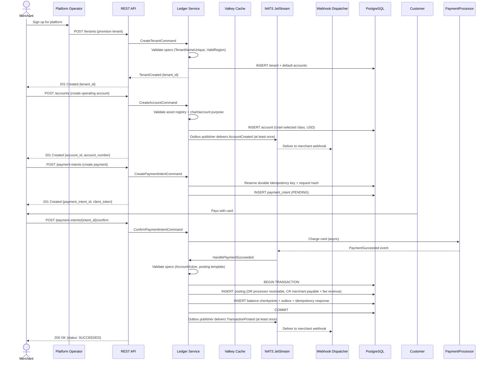
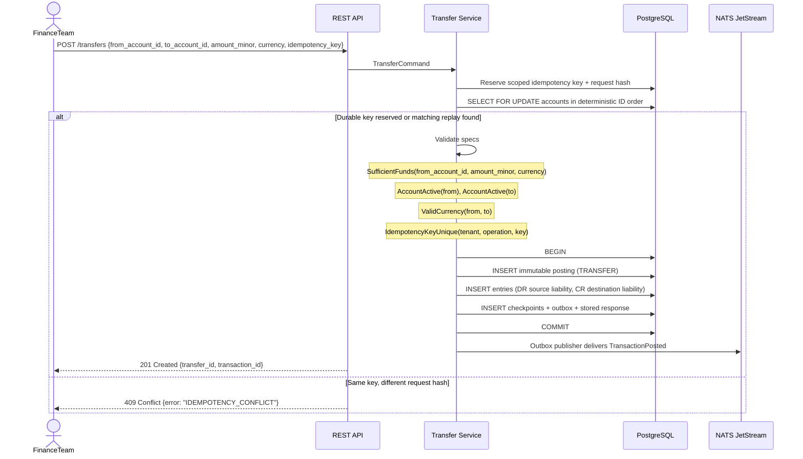
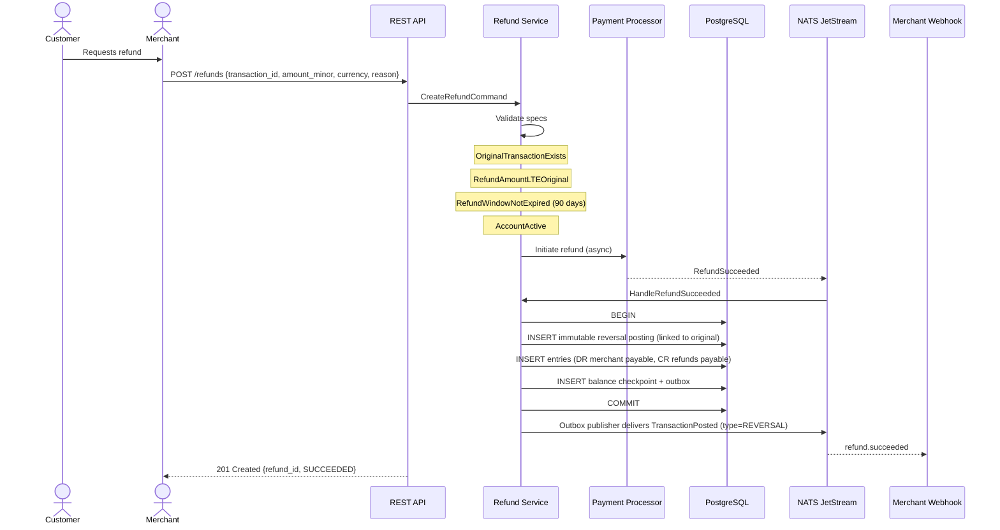
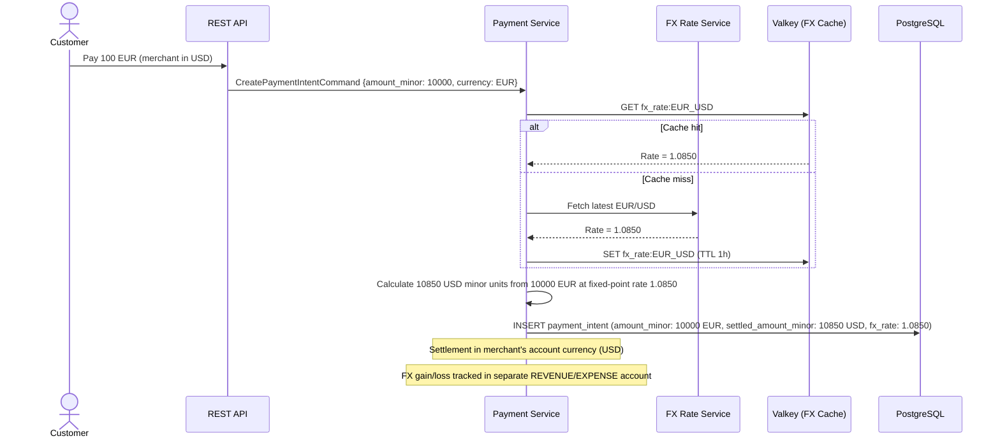
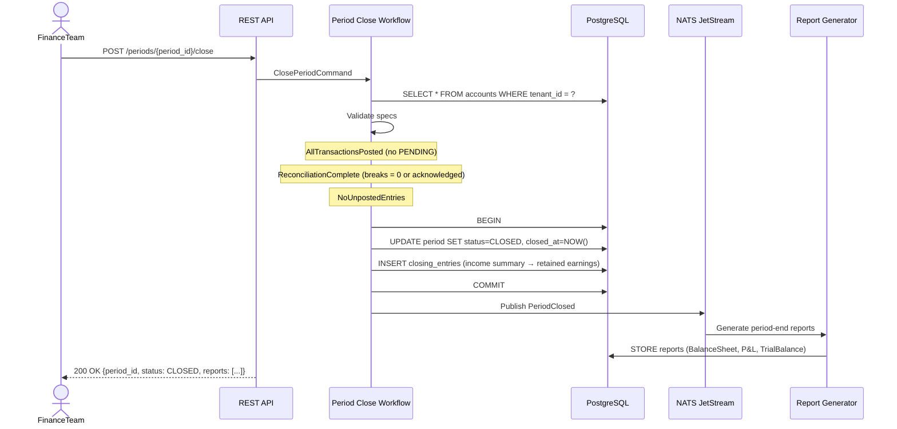
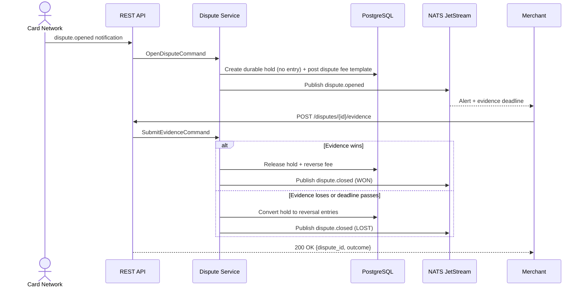

# Fintech Ledger - User Journey Design

**Version:** 1.0.0  
**Status:** Design Phase  
**Related:** [Ledger Core](./ledger-core.md), [Feature Spec](./fintech-ledger-features.md), [Money Flow](./money-flow.md), [Data Flow](./data-flow.md)

> Event names in the journey matrix are readable shorthand. Wire subjects and
> payload schemas use the versioned names in `docs/domain-events.md` (for
> example, `tenant.created.v1` and `transaction.posted.v1`).

---

## 1. Personas

| Persona | Description | Primary Goals |
|---------|-------------|---------------|
| **Platform Operator** | Runs the fintech platform (Stripe-like) | Manage tenants, monitor system health, compliance |
| **Merchant/Tenant** | Business using the platform to accept payments | Receive payments, manage accounts, reconcile |
| **End Customer** | Merchant's customer making payments | Pay easily, see transaction history |
| **Finance Team** | Merchant's accounting/finance | Reconcile, generate reports, period close |
| **Compliance Officer** | Regulatory/compliance monitoring | AML reviews, audit trails, reporting |
| **Developer** | Integrates with platform APIs | Build integrations, test in sandbox |

---

## 2. Core User Journeys

> Convention: endpoint paths below omit the `/v1` prefix for brevity.
> All paths map 1:1 to `docs/api-contracts.md` §7 (e.g., `POST /accounts` → `POST /v1/accounts`).

### 2.1 Journey: Merchant Onboarding & First Payment



**Key Touchpoints:**
1. **Tenant Provisioning** - Creates isolated ledger with default chart of accounts
2. **Account Creation** - Chart-selected account; merchant funds use a payable
   liability account rather than an asset merely because money is received
3. **Payment Intent** - Idempotent, supports retries
4. **Payment Confirmation** - Async processing, webhook notification
5. **Ledger Posting** - Atomic double-entry, immediate balance update

---

### 2.2 Journey: Internal Transfer Between Accounts



**Critical Invariants Enforced:**
- **Atomicity** - Single transaction, both entries or none
- **Idempotency** - PostgreSQL uniqueness + request fingerprint returns the original result or a conflict
- **Consistency** - Sufficient funds checked WITHIN transaction
- **Isolation** - SELECT FOR UPDATE prevents race conditions

---

### 2.3 Journey: Daily Reconciliation (Automated)

```mermaid
sequenceDiagram
    participant Cron as Cron Scheduler (gocron)
    participant Ledger as Reconciliation Workflow
    participant PostgreSQL as PostgreSQL
    participant Valkey as Valkey
    participant BankAPI as Bank API (SFTP/API)
    participant NATS as NATS JetStream
    participant Alert as Alerting (PagerDuty)

    Cron->>Ledger: Trigger DailyReconciliationWorkflow (02:00 UTC)
    Ledger->>Valkey: Acquire Distributed Lock (reconciliation:{date})
    alt Lock acquired
        Ledger->>PostgreSQL: SELECT accounts needing reconciliation
        par For each account
            Ledger->>BankAPI: Fetch statement (MT940/BAI2/CSV)
            Ledger->>Ledger: Parse statement
            Ledger->>Ledger: Match ledger entries to statement lines
            alt Match found
                Ledger->>PostgreSQL: INSERT reconciliation_match
                Note over Ledger,PostgreSQL: Entry remains immutable; match stores source ID, rule version, and decision
            else Mismatch (amount/date/reference)
                Ledger->>PostgreSQL: INSERT reconciliation_break
                Ledger->>NATS: Publish ReconciliationBreakFound
                NATS-->>Alert: Send alert to Finance Team
            end
        end
        Ledger->>PostgreSQL: INSERT reconciliation_run (status, breaks_count)
        Ledger->>Valkey: Release Lock
    else Lock failed (another instance running)
        Cron-->>Ledger: Skip (already running)
    end
```

**Reconciliation Break Types:**
| Break Type | Detection | Resolution |
|------------|-----------|------------|
| **Missing in Ledger** | Bank has entry, ledger doesn't | Investigate: failed webhook, timing diff |
| **Missing in Bank** | Ledger has entry, bank doesn't | Investigate: rejected payment, reversal |
| **Amount Mismatch** | Same ref, different amounts | Investigate: fees, FX, partial settlement |
| **Date Mismatch** | Same ref/amount, different dates | Usually timing - auto-resolve next day |

---

### 2.4 Journey: End-Customer Refund



**Refund Variants:**
| Type | Description | Ledger Impact |
|------|-------------|---------------|
| **Full Refund** | Entire transaction reversed | Mirror entries with opposite direction |
| **Partial Refund** | Portion of amount | Proportional entries |
| **Refund to Different Method** | Card → Bank transfer | Separate settlement tracking |

---

### 2.5 Journey: Multi-Currency Payment with FX



---

### 2.6 Journey: Period Close (Month-End)



**Period Close Validations:**
- No unresolved payment/settlement workflows affecting the period
- All reconciliation breaks resolved or acknowledged
- All sub-ledgers balanced
- FX revaluation posted (if multi-currency)

---

### 2.7 Journey: Dispute Lifecycle (Chargeback)



**Dispute Rules Recap:**
- The hold and fee posting are created atomically at open; the hold itself is
  not a journal entry. Evidence has a network deadline.
- Representment stages and evidence rules come from versioned network policy.
- Fraud early warnings auto-refund when cheaper than the dispute fee.

---

## 3. Journey Summary Matrix

| Journey | Primary Actor | API Endpoints | Key Domain Services | Events Published |
|---------|---------------|---------------|---------------------|------------------|
| Merchant Onboarding | Platform Operator | POST /tenants, /accounts | TenantService, AccountService | TenantCreated, AccountCreated |
| First Payment | Merchant/Customer | POST /payment-intents, /confirm | PaymentService, TransferService | PaymentIntentCreated, TransactionPosted |
| Internal Transfer | Finance Team | POST /transfers | TransferService | TransactionPosted |
| Daily Reconciliation | System (Cron) | N/A (internal) | ReconciliationWorkflow | ReconciliationBreakFound, ReconciliationCompleted |
| Refund | Merchant | POST /refunds | RefundService | TransactionPosted (REVERSAL) |
| Multi-Currency Pay | Customer | POST /payment-intents | PaymentService, FXService | TransactionPosted |
| Period Close | Finance Team | POST /periods/{period_id}/close | PeriodCloseWorkflow | PeriodClosed |
| Dispute Lifecycle | Card Network / Merchant | POST /disputes, /evidence, /represent, /close | DisputeService | dispute.opened, dispute.closed |

---

## 4. Error Handling & Compensation

| Failure Point | Detection | Compensation |
|---------------|-----------|--------------|
| Payment processor timeout | Circuit breaker opens | PaymentIntent stays PENDING/OUTCOME_UNKNOWN; resolve provider status by idempotency key before retry |
| Database deadlock | PostgreSQL error 40P01 | Retry with exponential backoff (max 3) |
| Insufficient funds | Specification failure | Return 400 with INSUFFICIENT_FUNDS code |
| Idempotency conflict | PostgreSQL durable key/fingerprint differs | Return 409 with existing posting/workflow ID |
| Reconciliation break | Mismatch detected | Create break record, alert, manual resolution workflow |
| Period close validation fails | Specification failure | Return 400 with list of failing checks |

---

## 5. Security & Compliance Touchpoints

| Journey Step | Security Control | Compliance Artifact |
|--------------|------------------|---------------------|
| Authentication | JWT validation (RS256) | Auth log entry |
| Authorization | Casbin policy check | Authorization decision log |
| Payment creation | Idempotency key validation | Idempotency record |
| Ledger posting | Double-entry validation | Transaction + entries (immutable) |
| Webhook delivery | Signature verification | Delivery receipt |
| Period close | Multi-person approval (configurable) | Approval audit trail |

---

*This document should be reviewed by all implementation agents before Phase 2 (Domain Layer) begins.*
